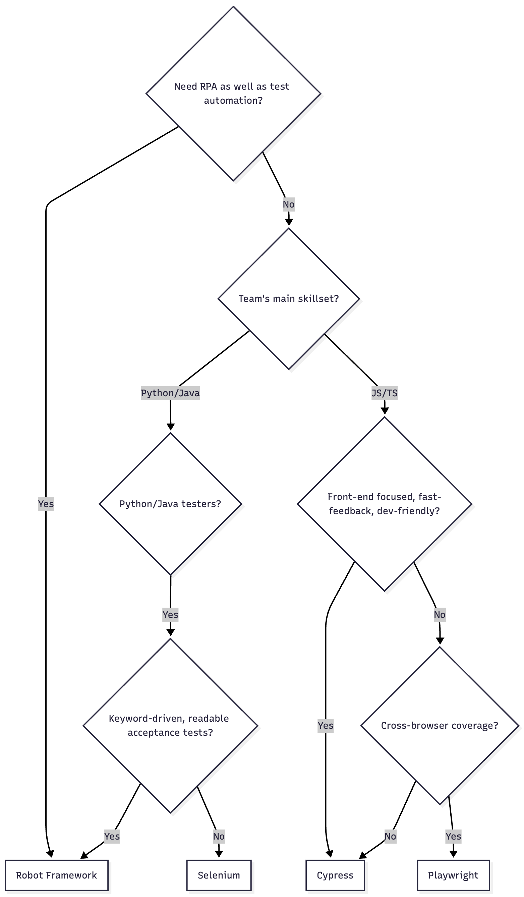
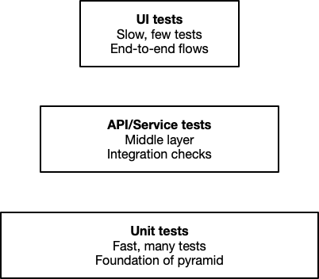
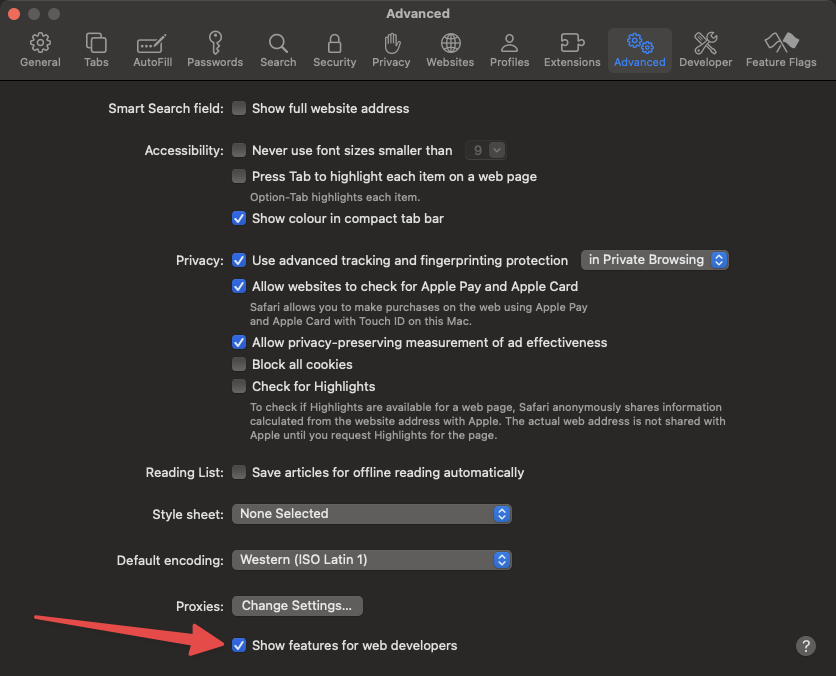
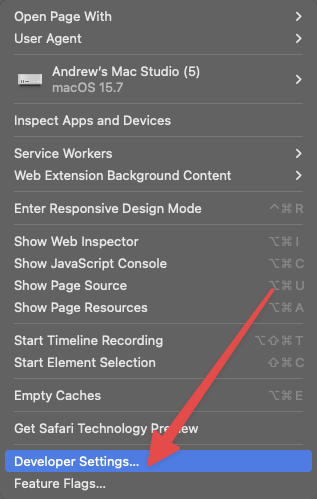
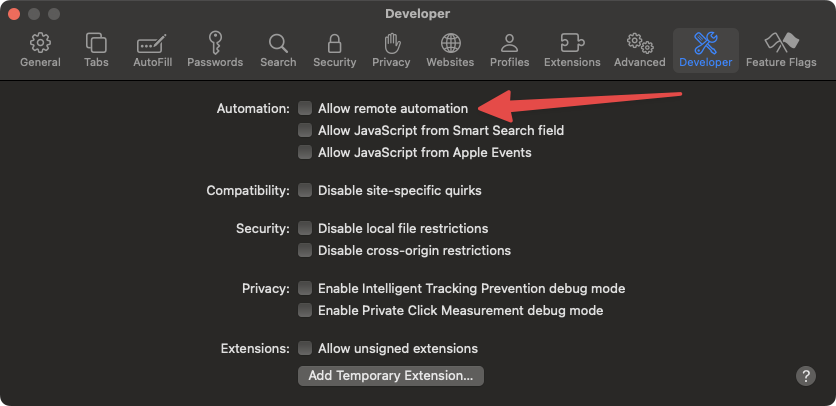
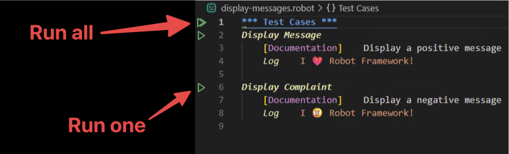
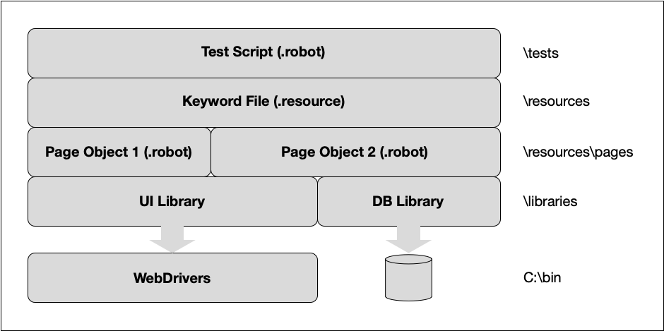
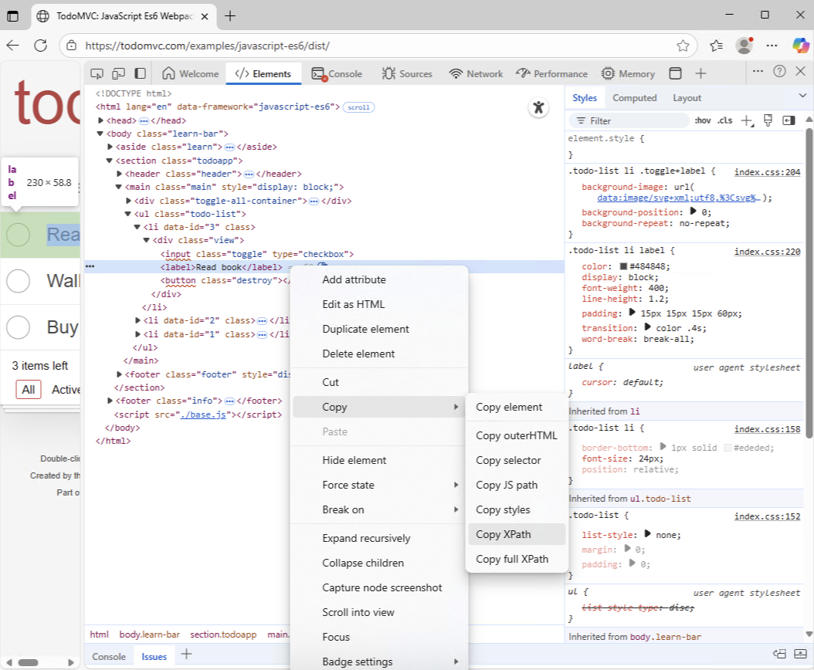
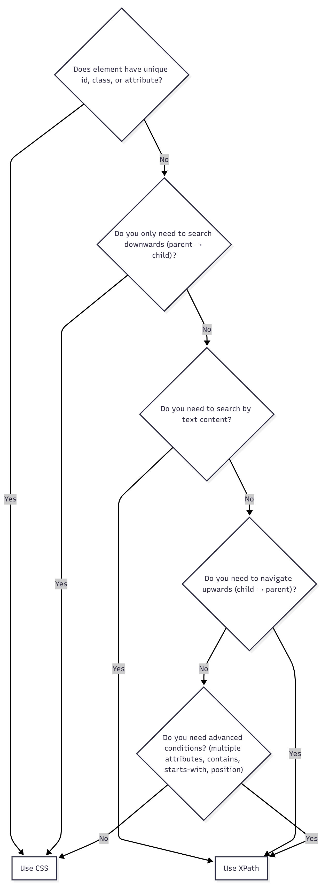

# Essential Robot Framework

- Course introduction
- Introduction to Robot Framework
- Installing Robot Framework
- Creating scripts
- Planning test scripts
- Running tests
- Project organisation
- Best practices for writing scripts
- Robocop
- Control structures
- Gherkin
- Robot Framework libraries
- Testing web apps using Selenium
- Testing web apps using Playwright
- Testing APIs
- Writing custom keywords using Python
- End-to-end testing
- Additional resources

## Course introduction

### Course notes

- Course notes are provided as [Markdown](https://www.markdownguide.org) documents
- Markdown documents can be displayed in editors/IDEs
- Supports effortless cut-and-paste from documents to code editor
- PDF version available

### Code samples

- Code samples are provided for all code in notes
- `scripts` folder contains examples
	- Organised by module titles
- `solutions` folder contains solutions to exercises
	- Organised by module titles

### Philosophy

- Very “hands on”
- A lot of time will be spent reviewing, writing and executing examples
- Competency in technical subjects requires doing the tasks
- Reviewing and playing with solutions is a viable approach

## Introduction to Robot Framework

### Objective

- Introduce test automation and Robot Framework.

### Demo: Teaser

- Check if the price of a book has dropped on Amazon
	-  See `check-book-price.robot` script
- Never work with children, animals or live websites

### What is a test automation framework?

- (Abstraction) Language for writing tests
- Ability to write scripts
- Modularisation (e.g. for reuse)
- Libraries to extend basic functionality
- Flexible test runner
- Reporting tools that support varying levels of detail (e.g. summaries)
- Integration with build systems
- Conventions
- Community

### What is Robotic Process Automation (RPA)?

- Uses software “robots” to automate repetitive tasks
- Technically similar to test automation, but philosophically distinct
- RPA is about performing business tasks
- Generally involves machines you don't control
- Repeatable, robust behaviour is essential
- Errors must be handled gracefully
- Security issues must be addressed
- Executes without close monitoring by IT professionals

### Robot Framework and RPA

- Robot Framework project contains libraries for RPA
- Instead of `*** Test Cases ***` we have `*** Tasks ***`
- Calling out to browsers and applications is the same in test automation and RPA
- This course places the focus on test automation

### History

- 2004: Ideas emerged from Pekka Krärck's masters thesis
- 2005–2006: Robot Framework was developed at Nokia Networks as an internal test automation tool
- 2008: Released as open source (Apache License 2.0)
- 2009: The first major community contributions and external libraries (such as SeleniumLibrary) began to appear
- 2010s: Robot Framework gained strong adoption in industries like telecom, finance and IT services
- 2015 onward: The Robot Framework Foundation was formed to support development, governance and community growth
- Current version (September 2025) is 7.3.2

### Features

- Open-source and free
- Readable, keyword-driven syntax: easy for testers and non-programmers to understand
- Highly extensible: supports custom Python/Java libraries
- Large ecosystem: many libraries for web, API, mobile, DB, desktop, RPA
- Cross-platform: runs on Linux, Windows and macOS.
- Integration with CI/CD
- Strong reporting
- Tagging and test selection
- Reusable components
- Parallel execution support
- Good for acceptance testing and RPA
- Active community and documentation

### Limitations

- Not as fast as lower-level test frameworks
- Keyword-driven approach can get bulky
- Limited debugging features
- Learning curve for advanced usage
	- While basics are easy, mastering libraries, custom keywords and optimisation requires effort.
- Dependent on external libraries
- Less suited for unit testing
- Reports can get large
- Limited IDE support

### Demo: Illustrate natural language

- Use keywords to make test cases more readable
	 
### Robot Framework vs alternatives

- Robot Framework
	- Acceptance testing
    - RPA
    - System testing
    - Python teams
- Selenium
	- Classic UI automation
    - Multi-language
    - Flexible but code-heavy
- Cypress
	- Developer-friendly
    - JavaScript-only
    - Great for frontend web apps
    - Fast feedback
- Playwright
	- Modern
    - Powerful
    - Cross-browser
    - Multi-language
    - Best balance of speed and coverage

### Test automation framework feature comparison  

| Feature / Tool            | **Robot Framework**                          | **Selenium**                                 | **Cypress**                                                 | **Playwright**                                |
| ------------------------- | -------------------------------------------- | -------------------------------------------- | ----------------------------------------------------------- | --------------------------------------------- |
| **Type**                  | Test automation + RPA framework              | Browser automation library                   | JavaScript E2E test framework                               | Modern browser automation & testing framework |
| **Programming Style**     | Keyword-driven (can use Python/Java)         | Code-driven (Java, Python, C#, etc.)         | JavaScript/TypeScript only                                  | JavaScript, TypeScript, Python, C#, Java      |
| **Best Suited For**       | Acceptance testing, RPA, system-level tests  | Web UI automation (flexible, cross-language) | Frontend testing (fast, dev-friendly)                       | Cross-browser modern web testing              |
| **Ease of Use**           | High (readable, keyword-driven)              | Medium (requires coding)                     | High (easy for JS devs)                                     | Medium-high (code-driven but simple API)      |
| **Cross-Browser**         | via SeleniumLibrary                          | (all major browsers)                         | Limited (Chrome-family + Edge, experimental Firefox/WebKit) | (Chrome, Firefox, Safari, Edge)               |
| **Mobile Testing**        | via AppiumLibrary                            | via Appium                                   | (not supported)                                             | Limited (experimental)                        |
| **API Testing**           | (RequestsLibrary, others)                    | (not native)                                 | (built-in)                                                  | (built-in)                                    |
| **Performance**           | Moderate (keyword abstraction adds overhead) | Moderate (depends on bindings)               | Fast (runs inside browser)                                  | Fast (parallel & headless execution)          |
| **Parallel Execution**    | via Pabot                                    | (via Grid, cloud)                            | Limited (workarounds needed)                                | (native support)                              |
| **Reporting**             | Built-in HTML reports/logs                   | Needs external tools                         | Built-in dashboard & reports                                | Limited (needs external libraries)            |
| **Community & Ecosystem** | Large (RPA + testing)                        | Very large (long history)                    | Growing fast (JS ecosystem)                                 | Growing very fast (modern standard)           |
| **CI/CD Integration**     | (Jenkins, GitHub Actions, GitLab, etc.)      | (all CI tools)                               | (tight Node.js integration)                                 | Yes                                           |

### Test automation framework flowchart

- How do we decide which test automation framework to use?



### Different types of automation

- Unit tests: validate individual functions/methods
- API/Service tests: check backend services and data flow
- UI tests: automate user interactions (end-to-end flows)
- Integration tests: verify modules/systems work together
- Regression tests: ensure old features still work after changes
- Smoke/Sanity tests: quick stability checks after builds/fixes
- Performance tests: load, stress, spike, endurance testing
- Security tests: scan for vulnerabilities and weaknesses
- Database tests: validate data integrity and operations
- CI/CD continuous testing: automated tests in pipelines

### Test automation pyramid

- More low-level tests and less high-level ones
- Faster feedback
- Lower costs
- Higher reliability



### Exercise: Personalising the test automation pyramid

- Consider some of the automated tests you might run in your organisation
- Categorise them according to the test automation pyramid
	- Make sure you have at least one for each category
- Share some of your examples

## Installing Robot Framework

### Objective

- Configure a Robot Framework development environment.

### Overview

- Robot Framework is cross-platform (Linux, Windows and macOS)
- Lightweight installation process
- Requires some CLI knowledge
- General steps
	- Install `uv`
	- Install Python (using `uv`)
	- Create project (using `uv`)
	- Install Robot Framework (using `uv`)
	- Install required libraries (using `uv`)
	- Install required browsers
	- Install browser drivers
	- Install IDE
	- Install IDE extensions/plugins

### uv

- Python project and package manager
- Consolidates virtual environment and package management
- Focused on performance
- Single tool to replace `pip`, `pip-tools`, `pipx`, `poetry`, `pyenv`, `twine`, `virtualenv` and more

### Demo: `uv`

- Demonstrate using `uv` to manage projects and packages

### Browser drivers

 - Browser drivers act as bridges between client libraries and the browsers
- Each browser has its own drivers
	- ChromeDriver is used for Chrome
	- EdgeDriver is used for Edge
	- SafariDriver is used for Safari
	- GeckoDriver is used for Firefox
- Important to match your browser drivers to the version of the browser installed on your machine

### Demo: Windows installation

- Install `uv`
	```bash
		powershell -ExecutionPolicy ByPass -c "irm https://astral.sh/uv/install.ps1 | iex"
	```
- Install Python
	```bash
		uv python install
	```
- Create project
	```bash
		uv init windows-install-demo
	```
- Install Robot Framework
	- `uv add robot-framework`
- Install required libraries
	- `uv add robotframework-seleniumlibrary`
- Install required browsers
- Install browser drivers
	- Automatic with modern versions of Selenium ([https://www.selenium.dev/selenium/docs/api/py/index.html#drivers](https://www.selenium.dev/selenium/docs/api/py/index.html#drivers))
- Install IDE
	- Use GUI installer
- Install IDE extensions
	- Install [RobotCode](https://robotcode.io/) and Even Better TOML extensions

### Demo: Linux installation

- Install `uv`
	```bash
		curl -LsSf https://astral.sh/uv/install.sh | sh
	```
- Install Python
	```bash
		uv python install
	```
- Create project
	```bash
		uv init linux-install-demo
	```
- Install Robot Framework
	- `uv add robot-framework`
- Install required libraries
	- `uv add robotframework-seleniumlibrary`
- Install required browsers
- Install browser drivers
	- Automatic with modern versions of Selenium ([https://www.selenium.dev/selenium/docs/api/py/index.html#drivers](https://www.selenium.dev/selenium/docs/api/py/index.html#drivers))
- Install IDE
	```bash
		sudo apt install ./<file>.deb
	```
- Install IDE extensions
	- Install [RobotCode](https://robotcode.io/) and Better TOML extensions

### Mac installation

- Mac installation is similar to the Linux installation
	- VS Code is installed with a GUI installer
- Differences in the browser and browser driver installations
- Safari browser driver is preinstalled
	- To enable it via the command line use `safaridriver --enable`
	- Can be enabled via the GUI

#### Allow remote automation 







### Exercise: Configure your development environment

- Set up your development environment based on your own requirements

## Creating scripts

### Objective

- Write and run Robot Framework scripts.

### Script format

- Test scripts are text files---with a `.robot` or `.resource` extension
- Whitespace-separated format
	- At _least_ two spaces must be used to separate items
	- Separating items with four spaces is a popular convention
	- Single spaces can be used in identifiers
- Can also use tabs and pipe (`|`) characters (not recommended)
- Anything after `#` is a comment (i.e. ignored)
- Convention is to leave two blank lines between sections
- The line continuation “character” (`...`) can be use to split up long lines 

### Script file sections

- There are four basic sections in a test script
	- **Settings** section defines global configurations---such as libraries, resource files, variables and metadata---that apply to the whole test suite
	- **Variables** section is used to define reusable values, such as strings, numbers, lists or dictionaries, that can be referenced throughout the test suite
	- **Test Cases** section  defines individual test scenarios, each composed of a sequence of keywords that specify the steps and validations to be executed
	- **Keywords** section is used to define custom, reusable keyword implementations that combine simpler keywords into higher-level actions for better readability and maintainability

### Comment section

- Robot Framework supports a Comment section for lengthy comments that relate to the entire script


### Logging

- `Log` keyword logs a given message
	- It's part of the `BuiltIn` “standard” library that is always available
- [Extensive arguments](https://robotframework.org/robotframework/latest/libraries/BuiltIn.html#Log) modify its behaviour
- Adding `console=True` to your logging keywords will also output the logs in your output window
	- The `Log To Console` keyword is another way to achieve this

### Simple log script

```
*** Test Cases ***
Display Message
    [Documentation]    Display a message
    Log    I ❤️ Robot Framework!
```

Script is in `display-message.robot`

### Running scripts

- To run a script, if the virtual environment is activated, use

	```
	robot display-message.robot
	```

- If the environment _isn't_ active, use

	```
	uv run robot display-message.robot
	```

- More complex script execution options will be discussed later in the course.

### Reviewing results

- Report files provide an overview of the execution results
	- They provide a handy colour-coding to show whether the tests passed or failed
	- These are best when you are interested in an overview of a battery of tests
- Log files provide details about the executed test cases
	- They allow “drilling down” into the details
	- These are best when you want to investigate the details of specific test cases
- Results are discussed in more detail later in the course

### Exercise: Create a simple log script

- Create a script that displays a message of your choosing
- Execute the script
- Confirm that the test case passes
- Review the `report.html` file
- Review the `log.html` file
- Solution is in `display-my-message.robot`

### SeleniumLibrary

- SeleniumLibrary is a web testing library
- Automates browser interactions in support of web UI testing
- Built on top of Selenium WebDriver
- External library

	```
	uv add robotframework-seleniumlibrary
	```

- Common keywords
	-  Browser control 
		- `Open Browser`
		- `Close Browser`
		- `Close All Browsers`
		- `Go To`
	- Element interaction
		- `Click Element`
		- `Input Text`
		- `Clear Element Text`
		- `Press Keys`
	- Assertion
		- `Element Should Be Visible`
		- `Element Should Contain`
		- `Title Should Be`
		- `Page Should Contain`
	- Waiting
		- `Wait Until Element Is Visible`
		- `Wait Until Page Contains`
	- Screenshot
		- `Capture Page Screenshot`
- The library provides [many more keywords](https://robotframework.org/SeleniumLibrary/SeleniumLibrary.html)
- SeleniumLibrary is discussed in more detail later in the course

### Bing search script

```
*** Settings ***
Library     SeleniumLibrary


*** Test Cases ***
Open Bing And Search
    [Documentation]    Open Bing and Search
    Open Browser    https://www.bing.com    Edge
    Wait Until Element Is Visible    name=q    10s
    Input Text    name=q    Robot Framework
    Press Keys    name=q    ENTER
    Sleep    5s
    Wait Until Page Contains    Robot Framework
    Close Browser
```

Script is in `bing-search.robot`

### Exercise: Create a script to search Bing for your favourite animal

- Create a script that searches Bing for an animal of your choosing
- Execute the script
- Confirm that the test case passes
- Review the `report.html` file
- Review the `log.html` file
- Solution is in `animal-search.robot`

### Changing the browser

- Supported browsers are
	- Edge (`edge`)
	- Firefox (`firefox`, `ff`)
	- Google Chrome (`googlechrome`, `chrome`, `gc`)
	- Headless Chrome (`headlesschrome)`
	- Headless Firefox (`headlessfirefox)`
	- Internet Explorer (`internetexplorer`, `ie`)
	- Safari (`safari`)

### Exercise: Perform a search in Firefox

- Create a script that searches for “Robot Framework” using Bing in Firefox
- Solution is in `firefox-search.robot`

###  Performing a "traditional" UI test

```
*** Settings ***
Library     SeleniumLibrary


*** Test Cases ***
Add Single Todo And Verify It Appears And Is Counted
    [Documentation]    Add a todo and verify it appears in the list
    Open Browser    https://todomvc.com/examples/javascript-es6/dist/    Edge
    Wait Until Element Is Visible    css=input.new-todo    10s
    Click Element    css=input.new-todo
    Input Text    css=input.new-todo    Create Robot Framework course
    Press Keys    css=input.new-todo    ENTER
    Wait Until Element Is Visible
    ...    xpath=//ul[contains(@class,'todo-list')]//label[normalize-space(.)="Create Robot Framework course"]
    ...    10s
    Close Browser
```

Script is in `add-todo.robot`

### Exercise: Fail a test

-  Make a change that will cause the script in `add-todo.robot` to fail
- Review the `report.html` and `log.html` file
 - Solution is in `fail-a-test.robot`

## Planning test scripts

### Objective

Plan test cases prior to writing scripts.

### Why plan test cases?

- Ensures consistency across all tests
- Makes tests easier to understand and maintain
- Reduces missed details like preconditions or cleanup
- Helps new team members follow the same structure
- Improves traceability between requirements and tests
- Simplifies peer reviews and audits
- Supports automation by providing predictable formats
- Saves time when creating or updating tests
- Enhances readability and communication within teams
- Encourages clear definition of expected outcomes
- Increases efficiency by planning before writing code, reducing rework and confusion

### Test planning template

Test Case ID: TC-\<area\>-\<sequence\>
Title: \<short, outcome-focused name\>

Objective
  - What risk or behaviour does this test prove?

Preconditions (Given)
  - Environment: \<environment + version + feature flags\>
  - Data state: \<records that must exist/not exist\>
  - Access state: \<user roles, auth, tokens\>
  - External dependencies: \<mocks/stubs toggled on/off, test doubles\>
  - Start state: \<what page/screen/API state is assumed\>

Test data
- Inputs: \<values, boundary cases, fixtures, seeds\>
- Secrets: \<how credentials/keys are injected in CI\>

Steps (When): each step should be observable
  - 1. \<action\> → Expected: \<UI/API/system observation\>
  - 2. \<action\> → Expected: \<...\>
  - 3. …

Post-conditions (Then)
  - System state: \<DB/files/queues updated as expected?\>
  - Side effects: \<emails/metrics/events produced?\>
  - Idempotency/cleanup: \<what must be reset so test is repeatable?\>

Logging and artefacts
  - Screenshots/video on failure?
  - API traces saved where?
  - Attachments (Robot: `Log`/`Capture Page Screenshot`)?

Tags and priority
  - Tags: \<smoke|regression|critical|flaky|component\>
  - Priority: \<P1–P3\>
  - Owner: \<name/team\>
  - Links: \<story/bug/spec\>

### From plan to scripts

- Write the test plan with Preconditions to Steps to Post-conditions using the planning block
- Translate each item directly to `Ensure Preconditions`, step keywords, and `Validate Post-conditions`
- Keep all setup idempotent so tests are repeatable in CI
- Add `Capture Page Screenshot` in `Test Teardown` so failures have artefacts
- Tag aggressively (`[Tags] smoke`, `regression`, etc.) to slice suites in CI

## Running tests

### Objective

Run Robot Framework tests in a variety of environments and contexts.

### Testing is important

- It's important to run your tests frequently
- If tests are hard to run, you won't use them

### Running test cases via the command line

- The [syntax](https://robotframework.org/robotframework/latest/RobotFrameworkUserGuide.html#basic-usage-1) for running Robot Framework scripts is

	```
	robot [options] data        # with active env 
	uv run robot [options] data # without active env
	```

### Choosing test cases to execute

```
robot tests.robot
robot test*.robot
robot app-tests\
robot my-tests.robot your-tests.robot
```

- When executing a folder, all `.robot` files in the folder (including subfolders) are run by default
	- Folders starting with `.` or `_` are ignored

When executing test cases from multiple scripts, it can be useful to name the test suite.

```
robot -name All test*.robot
```

### File patterns

- `*` matches any string (including empty string)
- `?` matches a single character
- `[abc]` matches one of the characters
- `[!abc]` matches a character _not_ in the brackets
- `[a-z]` matches a character in the range (as does `[a-zA-Z0-9]`)
- `[!a-z]` matches a character _not_ in the range

### Command line options

- Format: Options start with `--` (long form) or `-` (short form)
- Case-insensitive: Option names are not case-sensitive
- Hyphen-insensitive: Hyphens can be used to improve readability
- Order: Options can be given in any order before the data sources (test suites, files, folders)
- Values:
	- If an option requires a value, it follows the option (e.g. `--name MySuite`)
	- Values containing spaces should be quoted
- Multiple use: Some options can be repeated (e.g,` --variable VAR:VALUE`)
- Boolean flags: Options without values toggle features on/off (e.g. `--dryrun`)
- Defaults: If not given, default values apply
- Combination: Multiple short options cannot be combined (e.g. `-N -d` is valid, `-Nd` is not)

### Common command line options

- The following are examples of command line options
	- `-N` / `--name`: Set the suite name
	- `-d` / `--outputdir`: Directory for output files
	- `-o` / `--output`: Name of the output XML file
	- `-l` / `--log`: Name of the log HTML file
	- `-r` / `--report`: Name of the report HTML file
	- `-x` / `--xunit`: Generate xUnit compatible result file
	- `-L` / `--loglevel`: Set log level (e.g., TRACE, DEBUG, INFO, WARN, ERROR)
	- `-i` / `--include`: Run tests with matching tags
	- `-e` / `--exclude`: Skip tests with matching tags
	- `-t` / `--test`: Run only a named test case
	- `-s` / `--suite`: Run only a named suite
	- `-v` / `--variable`: Set a variable (`VAR:VALUE`)
	- `--version`: Display the installed version of Robot Framework
	- `--variablefile`: Load variables from a Python or YAML file
	- `--dryrun`: Parse and validate tests without executing them
	- `--rerunfailed`: Re-run only tests failed in a previous output file
	- `--exitonfailure`: Stop execution after the first failed test
- Some of them are discussed later in the course

### Argument files

- Text files that contain command-line options and arguments
- Useful for long or frequently used command lines
- [Syntax rules](https://robotframework.org/robotframework/latest/RobotFrameworkUserGuide.html#argument-files)
	- One option/value per line
	- Options written exactly as in CLI (e.g., `--outputdir results`)
	- Variables can be set with `--variable VAR:VALUE`
	- Empty lines and lines starting with `#` are ignored (comments)	
	- Quoting works the same way as on the command line

### Sample argument file

```
--name MySuite
--outputdir results
--loglevel DEBUG
--variable URL:http://robotframework.org
--include smoke
```

### Using argument files

```
robot --argumentfile argfile.txt tests.robot
robot -A argfile1.txt -A argfile2.txt tests.robot
```

### Exercise: Using the command line to run test cases

- Run a simple test case from the command line
- Conduct a dry run using the `--dryrun` option
- Change the name of the log HTML file to `run-details.log` using the `--log` option
- Using a file pattern to run all the test cases (even if you only have one at this point) 

### Running a single test case

- Individual tests in a suite can be executed
	- `robot -t "Test Case 1" .\test.robot`
- This can be useful when debugging tests

### Exercise: Using the command line to run a single test case

- Execute a single test case by name
- Review the results
- Multiple test cases in `celebrate-capital-cities.robot`

### Running test cases via the IDE



Script is in `display-messages.robot`

### Exercise: Using the IDE to run test cases

- Create a file with two test cases
- Run all the test cases
	- Review the output
- Run a single test case
	- Review the output
- Multiple test cases in `celebrate-capital-cities.robot`

### Running test cases via batch files (Windows)

- Create a text file with a `.bat` extension

	```
	@echo off
	call C:\course\.venv\Scripts\activate.bat
	cd C:\course\scripts\running-tests
	call robot display-message.robot
	call C:\course\.venv\Scripts\deactivate.bat
	```

- Double-click the batch file to execute it
- Batch file is located in `run-tests.bat`

### Running test cases via batch files (Bash)

- Create a text file with a `.sh` extension (e.g. `run-tests.sh`)

	```
	#!/bin/bash
	source ~/course/.venv/Scripts/activate
	cd ~/course/scripts/running-tests
	robot display-messages.robot
	deactivate
	```

- Make sure the script has execute permissions set
- Run it using `./run-tests.sh`

### Exercise: Execute tests using a batch file

- Create a batch file to run a test script
- Change some of the options passed to the `robot` command
- Solution is in `with-options.bat`

### Run test cases via a scheduler (Windows)

- Open Task Scheduler
- Add a “Robot Framework” library folder
- Create a new task
- Add a “Start a program” action to launch the batch file
- Right-click on the task to “Run” it
- Add a trigger

### Run test cases via a scheduler (Linux)

-  Open your crontab editor
	- `EDITOR=nano crontab -e`
- Add a cron job line to run every minute
	- `* * * * * /home/user/course/scripts/running-tests/run-tests.sh`
- Check that the job is installed
	- `crontab -l`

### Run test cases via CI/CD

- Help identify bugs as early as possible
- Provides early feedback on code question
- Ensures consistent use of tests

### Run test cases via GitHub Actions

- Create a`.github/workflows` folder in your repository
- Add a `robot-framework.yaml` file

	```
	name: Run Robot Framework Tests

	on:
	  push:
	    branches:
	      - main

	jobs:
	  test:
	    runs-on: ubuntu-latest
	    steps:
	      - name: Check repository
	        uses: actions/checkout@v3

	      - name: Set up Python
	        uses: actions/setup-python@v4
	        with:
	          python-version: '3.12'

	      - name: Install dependencies
	        run: |
	          pip install robotframework robotframework-seleniumlibrary

	      - name: Run Robot Framework tests
	        env:
	          WORK_TOKEN: ${{ secrets.GIT_TOKEN }}
	          TZ: Europe/London
	        run: robot --outputdir results tests/

	      - name: Upload artifact
	        uses: actions/upload-artifact@v4
	        with:
	          name: robot-test-results
	          path: ./results
	```

- Push to GitHub
- Check results under the Actions tab in your GitHub repository

### Re-run failed tests

- If most tests pass, it's inefficient to keep running them all
- The test execution results can be stored and used to rerun just the failed tests

	```
	robot --output initial.xml tests.robot
	robot --rerunfailed initial.xml --output rerun.xml tests.robot
	```

- The results of the runs can then be merged using Rebot

	```
	rebot --merge initial.xml rerun.xml
	```

### Randomise execution order

- Tests should be independent of each other
- Running them in a random order can uncover subtle dependencies

	```
	robot --randomize all tests.robot
	```

### Exercise: Run tests in a random order

- Create a script with at least two test cases
- Run them in random order
- Do this a number of times to see the change in execution order
- Multiple test cases in `celebrate-capital-cities.robot`

### Running tests in parallel

- Running tests in parallel can save significant amounts of time
	- Especially with large test suites
- [Pabot](https://pabot.org) is a parallel executor for Robot Framework tests
- Installation
	- `uv add robotframework-pabot`
- Usage
	- `pabot tests`
	- e.g. `pabot scripts\running-tests\display-messages.robot`

### PabotLib

- PabotLib allows inter-process communication between parallel test processes
- Provides a shared resource mechanism, so tests can share data or manage access to limited resources
- Includes features like locking (to prevent concurrent access to the same resource)
- Enables data sharing between parallel tests using a central PabotLib process
- Exposes keywords like:
    - `Acquire Lock` / `Release Lock`
    - `Get Parallel Value For Key` / `Set Parallel Value For Key`
    - `Run Setup Only Once` / `Run Teardown Only Once`
- Useful for synchronizing tests, especially when multiple tests need exclusive access to shared systems or data
- Implemented as a Robot Framework remote library, communicating over TCP
- Helps maximize test execution speed while maintaining consistency across shared resources

### Pabot vs PabotLib

| Component    | What It Is                         | What It Does                                                                            |
| ------------ | ---------------------------------- | --------------------------------------------------------------------------------------- |
| **Pabot**    | A command-line tool (`pabot`)      | Splits your Robot Framework suites/test into multiple processes so they can run in parallel |
| **PabotLib** | A Robot Framework *remote library* | Provides a communication layer between those parallel processes                        |
|              |                                    | Offers synchronization features like shared variables and locks                        |

### Sharing values between processes

```
*** Settings ***
Library             pabot.PabotLib


*** Test Cases ***
Set Shared Value
    [Documentation]    Sets a shared value in PabotLib for other tests to use
    Set Parallel Value For Key    shared_message    Hello from Set Shared Value!

Use Shared Value
    [Documentation]    Gets the shared value set by another test
    ${msg}=    Get Parallel Value For Key    shared_message
    Log    The shared message is: ${msg}
```

Script is in `interprocess-communication.robot`

### Synchronisation using locks

```
*** Settings ***
Documentation       Locking demo

Library             pabot.pabotlib


*** Test Cases ***
Test Case 1
    [Documentation]    Test case 1
    Do Lengthy Test    1    5

Test Case 2
    [Documentation]    Test case 2
    Do Lengthy Test    2    5

Test Case 3
    [Documentation]    Test case 3
    Do Lengthy Test    3    5

Test Case 4
    [Documentation]    Test case 4
    Acquire Lock    my-lock
    Do Lengthy Test    4    5
    Release Lock    my-lock

Test Case 5
    [Documentation]    Test case 5
    Acquire Lock    my-lock
    Do Lengthy Test    5    5
    Release Lock    my-lock

Test Case 6
    [Documentation]    Test case 6
    Do Lengthy Test    6    5


*** Keywords ***
Do Lengthy Test
    [Documentation]    Do a test that takes a log of time
    [Arguments]    ${id}    ${duration}
    Log    Starting test case ${id}...    console=True
    Sleep    ${duration}s
    Log    Completed test case ${id}    console=True
```

Script is in `locking.robot`

### Ordering test execution with Pabot

- The `--ordering` option in Pabot lets you define the exact order of suite or test execution
- You enable it with `pabot --ordering order.txt tests\`
- The ordering file (`order.txt`) lists suites or tests in the order you want them to run
- Each line must start with `--suite` or `--test` (if `--testlevelsplit` is used)
- Names in the ordering file must match the ones in `.pabotsuitenames`
    - `.pabotsuitenames` is automatically generated by Pabot and lists all discovered suites and tests with their internal names
    - Use it as a reference when writing your ordering file
- `#WAIT` in the ordering file forces Pabot to wait until all previous items have finished before starting the next ones
- `{ ... }` groups suites or tests to run within the same process
- Items not listed in the ordering file are executed afterward in default order
- Ordering still allows parallel execution unless `#WAIT` is used to enforce sequence

### Demo: Ordering text execution

- Open the `ordering` project
- Review the files
- Change to its root folder
- Run it using `pabot --ordering data\order.txt - results\ tests\`
- Review the resulting `log.html` file

### Debugging tests

- Use `--loglevel DEBUG`
	- Shows detailed logs in console and log.html
- Add  `Log`, `Log To Console` or `Log Many` keywords
	- Print variable values or steps
- Run with `--dryrun`
	- Check syntax and variable issues without executing tests
- Use `--console VERBOSE`
	- See more step-by-step output in terminal
- Insert `Pause Execution` (Dialogs) or `Sleep`
	- Pause to inspect system state or UI
- Run a single test
	- `robot -t "Test Name" tests.robot`
	- Isolates failures
- Use `--variable`
	- Pass test variables directly to debug configurations
- Re-run failed tests with `--rerunfailed output.xml` 
	- Focus only on problematic cases
- Open `log.html`
	- Drill into keywords and variable states after execution
- In VS Code
	- Make sure you have installed RobotCode and Even Better TOML extensions
	- Use the inline Run/Debug icons to the left of test/suite to execute just that scope
	- Add a `launch.json` that runs `module: "robot"` with your args and `cwd` set to the project root

## Project organisation

### Objective

Impose structure on your Robot Framework projects.

### Moving beyond single files

- Single-file test suites are useful when learning
	- But they don't scale
- Like all software development activities, it's important to have structure as complexity increases
- There are many ways of structuring content
	- This course will follow a popular approach

### Script file sections (recap)

- Settings
- Variables
- Test Cases
- Keywords

### Project structure

-  Projects can be created as four top-level folders
	- tests
	- resources
	- results
	- libraries
- The resources folder may contain an additional pages folder

### Tests folder

- Entry points that contain the test cases
- Makes use of keywords in the resources folder
- May contain more than one file in a large project
- Test files will usually _not_ have a Keywords section
	- Keywords are imported

### Resources folder

- Contains keywords used by the test cases
- Keywords can, and generally should, make use of other keywords
- If the [Page Object Model](%20https://www.selenium.dev/documentation/test_practices/encouraged/page_object_models/) design pattern is used, then a pages subfolder will contain a resource file for each page (or component/form)
- Resource files are imported using the `Resource` keyword in the Settings section
- Resource files will not have a Test Cases section
- Keywords will be discussed in depth later in the course

### Results folder

- Contains the (generated) output from executing test cases
- `log.html`, `report.html` and `output.xml` files will be output to this folder
- Use the option `-d results` when running the `robot` command to output results to this folder

	```
	robot -d results tests\
	```

### Libraries folder

- The libraries folder contains any Python libraries you might develop/deploy
- Python libraries will be discussed later in the course

### Project layers



### Exercise: Scaffold a project

- Create a new project (e.g. using `uv init --bare scaffold-exercise`)
- Add the Robot Framework library
- Create the recommend project folders
- Create a simple test case
- Run the test, placing the output in the appropriate folder
- Solution is in `scaffold-exercise`

### Test suites

- A test suite is a collection of test cases and possibly other test suites
- Serves as a container to group related tests together (e.g. all login-related tests)
- Can also have its own setup and teardown, which run before and after all test cases in the suite
- Robot Framework automatically treats:
	- A .robot file as a test suite
	- A directory containing .robot files as a higher-level suite

## Best practices for writing scripts

### Objective

Write high quality test cases that are easy to use and maintain.

### Keywords

- [Keywords](https://robotframework.org/robotframework-RFCP-syllabus/docs/chapter-03/user_keyword) are the building blocks of Robot Framework test cases
- Reusable test steps (like functions)
- Three main categories of keywords
	- Built-in
	- Library (e.g. from SeleniumLibrary)
	- User-defined
- Can take arguments and return values
- Called inside test cases or other keywords
- Designed to resemble plain English
- Convention is to use title case for keyword names

### Benefits of keywords

- Reusability: write once, use many times across tests
- Readability: tests look like plain English, easy to understand
- Maintainability: update logic in one keyword instead of many test cases
- Abstraction: hide technical details, focus on test intent
- Modularity: break complex tests into smaller, manageable parts
- Collaboration: both testers and non-technical team members can understand and contribute
- Extensibility: easy to extend with custom Python/Java code when needed

### Using keywords

```
*** Test Cases ***
Login To Website
    [Documentation]    Login to example website
    Open Browser To Login Page
    Input Username And Password
    Submit Login Form
    Log    Close Browser


*** Keywords ***
Open Browser To Login Page
    [Documentation]    Open login page in Edge
    Log    Open https://example.com/login in Edge
    Log    Maximize browser window

Input Username And Password
    [Documentation]    Input username and password
    Log    Input user name into the text field
    Log    Input password into the text field

Submit Login Form
    [Documentation]    Submit the form
    Log    Click the login button
```

Script is in `simple-keywords.robot`

### Readable log files

- Review the log file
- Expand the test case
- The test case is now more readable as it's chunked by the new (higher level) keywords

### Exercise: Use keywords in test case

- Create a test case to order a product from a website
- Use keywords to improve readability
- Use `Log` keyword to implement the custom keywords
- Run the tests
- Review the log file to see how it's organised by keyword
- Solution is in `order-product.robot`

### Refactor a script

```
*** Settings ***
Library     SeleniumLibrary


*** Test Cases ***
Add Multiple Todos
    [Documentation]    Open the TodoMVC app, add three todos and close the browser
    Open Browser    https://todomvc.com/examples/javascript-es6/dist/    Edge
    Maximize Browser Window
    Input Text    css=input.new-todo    Buy milk
    Press Keys    css=input.new-todo    RETURN
    Input Text    css=input.new-todo    Walk the dog
    Press Keys    css=input.new-todo    RETURN
    Input Text    css=input.new-todo    Read a book
    Press Keys    css=input.new-todo    RETURN
    Sleep    5s
    Close Browser
```

Script is in `linear-script.robot`

### Refactoring scripts

- Group related items together
- Think of a name that describes all the steps in a group
- Create a keyword with that name
- Move the group items to that keyword
- Replace the group items with the keyword in the test case

### Refactored script

```
*** Settings ***
Library     SeleniumLibrary


*** Test Cases ***
Add Multiple Todos
    [Documentation]    Open the TodoMVC app, add three todos using keywords and close the browser
    Open TodoMVC App
    Add Todo Buy Milk
    Add Todo Walk Dog
    Add Todo Read Book
    Wait For Review
    Close TodoMVC App


*** Keywords ***
Open TodoMVC App
    [Documentation]    Open the TodoMVC app in Edge and maximise the browser window
    Open Browser    https://todomvc.com/examples/javascript-es6/dist/    Edge
    Maximize Browser Window

Add Todo Buy Milk
    [Documentation]    Add the todo item "Buy milk" to the list
    Input Text    css=input.new-todo    Buy milk
    Press Keys    css=input.new-todo    RETURN

Add Todo Walk Dog
    [Documentation]    Add the todo item "Walk the dog" to the list
    Input Text    css=input.new-todo    Walk the dog
    Press Keys    css=input.new-todo    RETURN

Add Todo Read Book
    [Documentation]    Add the todo item "Read a book" to the list
    Input Text    css=input.new-todo    Read a book
    Press Keys    css=input.new-todo    RETURN

Wait For Review
    [Documentation]    Pause to allow the todos to be seen
    Sleep    5s

Close TodoMVC App
    [Documentation]    Close the browser to finish the test
    Close Browser
```

Script is in `refactored-script.robot`

### Exercise: Create a test case using keywords

- Create a test case that searches Bing for “Robot Framework”
- Use keywords to improve readability
- Run the test case
- Review the log file
	- Note how it's organised around the new keywords
- Solution is in `bing-search-using-keywords.robot`

### Parameterised keywords

- Keywords can be made more generic using parameters
- Parameters are inputs passed to keywords
	- Similar to function arguments
- Replace hard-coded values with parameters to generalise actions
- Declared with `Arguments` inside a keyword definition
- Avoids duplicate keywords for similar tasks
- There are different types of parameters
	- Required
	- Default
	- Variable-length

### Parameterising the Add Todo keyword

```
*** Settings ***
Library     SeleniumLibrary


*** Test Cases ***
Add Multiple Todos
    [Documentation]    Open the TodoMVC app, add three todos using keywords and close the browser
    Open TodoMVC App
    Add Todo    Buy milk
    Add Todo    Walk dog
    Add Todo    Read book
    Wait For Review
    Close TodoMVC App


*** Keywords ***
Open TodoMVC App
    [Documentation]    Open the TodoMVC app in Edge and maximise the browser window
    Open Browser    https://todomvc.com/examples/javascript-es6/dist/    Edge
    Maximize Browser Window

Add Todo
    [Documentation]    Add a todo item to the list
    [Arguments]    ${item}
    Input Text    css=input.new-todo    ${item}
    Press Keys    css=input.new-todo    RETURN

Wait For Review
    [Documentation]    Pause to allow the todos to be seen
    Sleep    5s

Close TodoMVC App
    [Documentation]    Close the browser to finish the test
    Close Browser
```

Script is in `parameterised-add-todo.robot`

### Optional parameters

- Arguments can have default values
	- e.g. `[Arguments]    ${item}=Do stuff`
- If a value isn't supplied when the keyword is used then the default will be substituted

### Optional parameter example

```
*** Settings ***
Documentation       Test suite


*** Test Cases ***
Add A Single Todo
    [Documentation]    Add a single todo
    Add Todo


*** Keywords ***
Add Todo
    [Documentation]    Add a todo item to the list
    [Arguments]    ${item}=Do stuff
    Log    ${item}
```

Script is in `optional-parameter.robot`

### Variable length parameters

- Allow keywords to accept a flexible number of arguments
- Use a list parameter (`@`) to capture any remaining positional arguments
- Use a dictionary parameter (`&`) to capture any named arguments

### Variable length parameters example

```
*** Settings ***
Documentation       Test suite


*** Test Cases ***
Pass Multiple Arguments
    [Documentation]    Add a single todo
    Log Parameters    One    Two    Three    Four    special=Pi


*** Keywords ***
Log Parameters
    [Documentation]    Log parameters
    [Arguments]    ${first}    ${second}    @{rest}    &{named}
    Log    First: ${first}
    Log    Second: ${second}
    Log    Rest: ${rest}
    Log    Named: ${named}
```

Script is in `variable-length-parameters.robot`

### Exercise: Parameterise keywords

- Parameterise the `Search For Robot Framework` and `Wait For Results` keywords in the `bing-search-using-keywords.robot` script (in the solutions folder)
- The term to search/wait for should be passed as a parameter
- Change the test case to search for your favourite animal
- Run the test case and view the log file
- Solution is in `parameterised-search.robot`

### Placing keywords in resource files

- Placing everything in one file gets unwieldy
- Keywords can be removed from test files and placed in resource files
- Resource files are imported, as required
- Allows sharing of keywords across different tests
- Keywords can also be shared across different test suites/projects
- Resource files can import other resource files

### Refactor to move keywords to a resource file

Project is in `resource-file\`

- App-specific keywords are often placed in a resource file suffixed with `-app`
- Generic keywords can be placed in `common.robot`
- Note that the test files don't need to import libraries
	- This is done in the keyword files

#### `tests\todo.robot`

```
*** Settings ***
Resource    ../resources/common.resource
Resource    ../resources/todo-app.resource


*** Test Cases ***
Add Multiple Todos
    [Documentation]    Open the TodoMVC app, add three todos using keywords and close the browser
    Open App    https://todomvc.com/examples/javascript-es6/dist/    Edge
    Add Todo    Buy milk
    Add Todo    Walk dog
    Add Todo    Read book
    Wait For Review    5s
    Close App
```

#### `resources\common.resource`

```
*** Settings ***
Library     SeleniumLibrary


*** Keywords ***
Open App
    [Documentation]    Open the TodoMVC app in Edge and maximise the browser window
    [Arguments]    ${url}    ${browser}
    Open Browser    ${url}    ${browser}
    Maximize Browser Window

Wait For Review
    [Documentation]    Pause to allow the results to be seen
    [Arguments]    ${duration}
    Sleep    ${duration}

Close App
    [Documentation]    Close the browser
    Close Browser
```

#### `resources\todo-app.resource`

```
*** Settings ***
Library     SeleniumLibrary


*** Keywords ***
Add Todo
    [Documentation]    Add a todo item to the list
    [Arguments]    ${item}
    Input Text    css=input.new-todo    ${item}
    Press Keys    css=input.new-todo    RETURN
```

### Exercise: Move keywords to resource file

- Refactor the test script in `parameterised-search.robot` to place keywords in a separate resource file
- Run the test case and review the log file
- Solution is in `resource-file-for-search\`

### Keywords returning values

- Custom keywords can return values (e.g. back to a test case) using the `RETURN` statement
- Typically the last step inside a keyword
- Syntax is

    ```
    RETURN    value1    value2
    ```
	- Can return one or multiple values
- Assign the returned value(s) to variables in the test case with `=`

    ```
	${value}=    Get Value # (for a single value)
	${value1}    ${value2}=    Get Values
    ```

- Keywords act like functions, enabling calculations, data fetching or reusable logic
- Can return strings, numbers, lists, dictionaries or any evaluated value
	- Variables are discussed later in the course

### Calculating VAT using a keyword

```
*** Test Cases ***
Get VAT Inclusive Price
    [Documentation]    Calculates the price inclusive of sales tax
    ${vat_inclusive_price}=    Calculate Sales Tax Inclusive Price    35    20
    Log    VAT inclusive price: ${vat_inclusive_price}


*** Keywords ***
Calculate Sales Tax Inclusive Price
    [Documentation]    Calculates the price inclusive of sales tax
    [Arguments]    ${price}    ${rate}
    ${sales_tax_inclusive_price}=    Evaluate    ${price} * (1 + ${rate} / 100)
    RETURN    ${sales_tax_inclusive_price}
```

Script is in `calculate-vat.robot`

### Exercise: Convert Fahrenheit to Celsius using a keyword

- Create a keyword that converts a temperature in Fahrenheit to one in Celsius
- The formula is $C = \frac{5}{9}\,(F - 32)$
- Create test cases to log the Celsius temperatures for  32, 212 and 70 $\degree F$
- Solution is in `temperature-conversion.robot`

### Tags

- Tags label tests with descriptive names like "smoke" or "login"
- Make it easy to include or exclude specific tests during execution
- Can be used to filter test results in reports and logs
- Can assign multiple tags to one test
- Can come from the test, test suite or resource file
- Help organise, group and manage large test sets
- Inherited tags apply automatically unless explicitly changed

### Tagging test cases

```
*** Settings ***
Resource            ../resources/tags.resource

Suite Setup         Open App
Suite Teardown      Close Browser


*** Test Cases ***
Add Single Todo
    [Documentation]    Verify that a new todo item can be added successfully.
    [Tags]    smoke    add
    Add Todo    Buy milk
    Todo Should Exist    Buy milk

Complete Todo
    [Documentation]    Verify that an existing todo can be marked as completed.
    [Tags]    regression    complete
    Add Todo    Read book
    Complete Todo    Read book
    Todo Should Be Completed    Read book

Delete Todo
    [Documentation]    Verify that a todo item can be deleted from the list.
    [Tags]    regression    delete
    Add Todo    Walk dog
    Delete Todo    Walk dog
    Todo Should Not Exist    Walk dog
```

Project is in `tags\`

### Demo: Run tagged tests

- Filter the tests to be run using tags
- Run only the `smoke` tests
	- `robot --include smoke tests`
- Run all tests _except_ the smoke tests
	- `robot --exclude smoke tests`

### Page Objects

- Page Object Model is a design pattern that organises locators and actions for each web page into separate files (keywords)
- Encapsulates page-specific logic, keeping test cases clean and readable
- One resource file (or class) per page, containing only that page's keywords
- Keywords for a page can be reused across multiple tests
- If a locator changes, only the Page Object file needs updating
- Tests describe _what_ is done, not _how_ it's implemented
- Makes large UI test suites easier to manage
- Ensures common actions (like login or navigation) behave the same across tests
- Page Objects will be used more extensively when we discuss web app testing

### Refactor to use Page Objects

Project is in `page-objects\`

#### `tests\todo.robot`

```
*** Settings ***
Resource    ../resources/common.robot
Resource    ../resources/todo-app.robot


*** Test Cases ***
Add Multiple Todos
    [Documentation]    Open the TodoMVC app, add three todos using keywords and close the browser
    Open App    https://todomvc.com/examples/javascript-es6/dist/    Edge
    todo-app.Add Todo    Buy milk
    todo-app.Add Todo    Walk dog
    todo-app.Add Todo    Read book
    Wait For Review    5s
    Close App
```

#### `resources\common.resource`

```
*** Settings ***
Library     SeleniumLibrary


*** Keywords ***
Open App
    [Documentation]    Open the TodoMVC app in Edge and maximise the browser window
    [Arguments]    ${url}    ${browser}
    Open Browser    ${url}    ${browser}
    Maximize Browser Window

Wait For Review
    [Documentation]    Pause to allow the results to be seen
    [Arguments]    ${duration}
    Sleep    ${duration}

Close App
    [Documentation]    Close the browser
    Close Browser
```

#### `resources\todo-app.resource`

```
*** Settings ***
Resource    ./pages/todo.resource


*** Keywords ***
Add Todo
    [Documentation]    Add a todo item to the list
    [Arguments]    ${item}
    todo.Add Todo    $item}
```

#### `resources\pages\todo.resource`

```
*** Settings ***
Library     SeleniumLibrary


*** Keywords ***
Add Todo
    [Documentation]    Add a todo item to the list
    [Arguments]    ${item}
    Input Text    css=input.new-todo    ${item}
    Press Keys    css=input.new-todo    RETURN
```

#### Fully-qualified keyword names

- The previous example had resource names like `todo.Add Todo` and `todo-app.Add Todo`
- These are fully-qualified names that include the resource file that contains the keyword
- This style is common in larger projects
- Resolves name conflicts
- Makes it easier for developers to find keyword definitions
- Essential in bigger projects where many Page Objects or libraries are imported

### Test setup/teardown

- Test setup
	- Runs before a test case starts
	- Used for preparing the environment (e.g. opening browser, logging in, initialising data)
	- Ensures each test begins in a known, consistent state
- Test teardown
	- Runs after a test case finishes (whether it passes or fails)
	- Used for cleanup (e.g. closing browser, logging out, clearing data)
	- Ensures the system is reset and ready for the next test
- Keep test cases clean by moving repetitive setup and cleanup steps into centralised hooks

### Benefits of using test setup/teardown

- Common pre- and post-steps are defined once and reused across tests
- Update setup/teardown logic in one place instead of every test case
- Keeps test cases focused on the actual scenario, not boilerplate steps
- Ensures all tests start and end in a clean, predictable state
- Teardown runs even if the test fails, helping reset environment/resources (i.e. error isolation)
- Avoids repeating the same open/close/setup steps manually in each test

### Test setup/teardown example

```
*** Settings ***
Library             SeleniumLibrary

Test Setup          Open App
Test Teardown       Close App


*** Test Cases ***
Add One Todo
    [Documentation]    Opens TodoMVC (via setup), adds one todo item, then closes the browser (via teardown)
    Add Todo    Buy milk

Add Two Todos
    [Documentation]    Opens TodoMVC (via setup), adds two todo items, then closes the browser (via teardown)
    Add Todo    Walk the dog
    Add Todo    Read a book


*** Keywords ***
Open App
    [Documentation]    Opens the TodoMVC app and maximises the browser window
    Open Browser    https://todomvc.com/examples/javascript-es6/dist/    Edge
    Maximize Browser Window

Add Todo
    [Documentation]    Adds a new todo item to the TodoMVC app. Takes one argument: the todo text.
    [Arguments]    ${item}
    Input Text    css=input.new-todo    ${item}
    Press Keys    css=input.new-todo    RETURN

Close App
    [Documentation]    Pauses before closing the TodoMVC app
    Sleep    5s
    Close Browser
```

Script is in `setup-teardown.robot`

### Exercise: Use test setup/teardown with Bing search

- Open and review the `parameterised-search.robot` solution
- Refactor it to use test setup/teardown
- Open Bing in the setup
- Pause before closing the browser in the teardown
- Solution is in `setup-teardown-with-bing.robot`

### Variables

- Variables allow the storage of reusable values
- Variable identifiers
	- `$` for scalars
	- `@` for lists
	- `&` for dictionaries
	- `%` for environment variables
- Scopes
	- Test case (local)
	- Suite (within the test suite)
	- Global (across all test suites)
- Sources
	- Defined in test cases or resource files
	- Passed from command line (`--variable name:value`)
	- Contained in variable files (Python or YAML)
- Support string interpolation
- There are a number of special, built-in variables
	- e.g. `${CURDIR}`, `${TEST_NAME}`

### Variable precedence

- From lowest to highest precedence
	- Built-in variables
	- Variables from variable files (variables in settings, Python/YAML files)
	- Variables from resource files (imported with Resource)
	- Variables defined in the test suite file (Variables section)
	- Command line variables (`--variable name:value`)
	- Local variables (set inside a test case/keyword with `VAR`)

### Magic constants

- Magic constants are unexplained hard-coded values (like numbers or strings) placed directly in test cases/keywords without a clear name or context
- Why are magic constants bad?
	- Test cases become unclear when numbers/strings appear directly in keywords without explanation
	- Harder to maintain---if a value changes (like a timeout, URL, or selector), you'd need to hunt it down everywhere
	- More error-prone---you might forget to update one instance, leading to inconsistent tests
- How can we avoid them?
	- Define constants in the Variables section with clear names
	- Use resource files to share constants across multiple suites
	- For sets of related values, use dictionaries or lists
	- Externalise changing values into environment variables or variable files for easier configuration

### Variable types

```
*** Variables ***
${USERNAME}         Jane
@{ANIMALS}          Cat    Dog    Hedgehog
&{CREDENTIALS}      user=admin    password=1234


*** Test Cases ***
Variable Types
    [Documentation]    Demonstrates scalar, list, dictionary, command-line and built-in variables

    # Scalar
    Log    Hello, ${USERNAME}!

    # List
    Log    First animal: ${ANIMALS}[0]
    Log    All animals: @{ANIMALS}

    # Dictionary
    Log    Login with user: ${CREDENTIALS.user} and password: ${CREDENTIALS.password}

    # Command line variable (e.g. run with: robot --variable BROWSER:chrome this_suite.robot)
    Log    Running tests in browser: ${BROWSER}

    # Built-in variables
    Log    Current directory: ${CURDIR}
    Log    Current test: ${TEST NAME}
```

Script is in `variable-types.robot`

### Variable scope

- Convention for global variables is `${UPPER_SNAKE_CASE}`
- Convention for local variables is `${lower_snake_case}`
- Use global variables for values that cross the entire suite
- Use local variables for values that are specific to a single test case
- There's some judgement involved in the choice between global and local variables

### Global variables

```
*** Settings ***
Library             SeleniumLibrary

Test Setup          Open App
Test Teardown       Close App


*** Variables ***
${APP_URL}      https://todomvc.com/examples/javascript-es6/dist/
${BROWSER}      Edge


*** Test Cases ***
Add Todo
    [Documentation]    Opens TodoMVC (via setup), adds one todo item, then closes the browser (via teardown)
    Add Todo    Buy milk


*** Keywords ***
Open App
    [Documentation]    Opens the TodoMVC app and maximises the browser window
    Open Browser    ${APP_URL}    ${BROWSER}
    Maximize Browser Window

Add Todo
    [Documentation]    Adds a new todo item to the TodoMVC app. Takes one argument: the todo text.
    [Arguments]    ${item}
    Input Text    css=input.new-todo    ${item}
    Press Keys    css=input.new-todo    RETURN

Close App
    [Documentation]    Pauses before closing the TodoMVC app
    Sleep    5s
    Close Browser
```

Script is in `global-variables.robot`

### Local variables

```
*** Settings ***
Documentation       Test suite

Library             SeleniumLibrary

Test Setup          Open App
Test Teardown       Close App


*** Test Cases ***
Add One Todo
    [Documentation]    Opens TodoMVC (via setup), adds one todo item, then closes the browser (via teardown)
    Add Todo    Buy milk


*** Keywords ***
Open App
    [Documentation]    Opens the TodoMVC app and maximises the browser window
    VAR    ${app_url}    https://todomvc.com/examples/javascript-es6/dist/
    VAR    ${browser}    Edge
    Open Browser    ${app_url}    ${browser}
    Maximize Browser Window

Add Todo
    [Documentation]    Adds a new todo item to the TodoMVC app. Takes one argument: the todo text.
    [Arguments]    ${item}
    Input Text    css=input.new-todo    ${item}
    Press Keys    css=input.new-todo    RETURN

Close App
    [Documentation]    Pauses before closing the TodoMVC app
    Sleep    5s
    Close Browser
```

Script is in `local-variables.robot`

### Exercise: Move magic constants to variables

- Refactor `setup-teardown-with-bing.robot` to replace the magic constants with global variables
- Solution is in `no-magic-constants.robot`

### Variable files

-  Used to store variables outside the test suite for easier reuse and maintenance
- Can be Python or YAML files
	- YAML files require the `pyyaml` package, so Python files are preferred
- Declared in the Settings section, using the Variables keyword (e.g. `Variables   variables.py`)
- Helps keep sensitive data (passwords, URLs, configs) or environment-specific values separate from test logic
 - Variables from variable files can be overridden via command-line (`--variable`)

### Using a Python variable file

Project is in `variable-file\`

#### `libraries\variables.py`

```python
# Scalar
USERNAME = "Jane"
PASSWORD = "1234"

# List
ANIMALS = ["Cat", "Dog", "Hedgehog"]

# Dictionary
CREDENTIALS = {"user": "admin", "password": "secret"}

# URL
BASE_URL = "https://todomvc.com/examples/javascript-es6/dist/"
```

#### `tests\variable-file.robot`

```
*** Settings ***
Documentation       Test suite

Variables           ../libraries/variables.py


*** Test Cases ***
Use Variables From File
    [Documentation]    Demonstrate accessing variables imported from variables.py
    Log    Username: ${USERNAME}
    Log    Password: ${PASSWORD}
    Log    Animals: @{ANIMALS}
    Log    User from dict: ${CREDENTIALS}[user]
    Log    API URL: ${BASE_URL}/api
```

### Test suite variables

- We can also define test suite variables as follows

    ```
    VAR    ${BROWSER}    Edge    scope=SUITE
    ```

- This can be useful for setting authentication tokens at the suite level when they are returned from an API

### Environment variables

- Read from the operating system
- `%{BROWSER}` gets the OS environment variable `BROWSER`
- If you use `%{...}`, it's always taken from the OS, regardless of other variable definitions
- Common use
	- Configure secrets, API keys or environment configs via OS environment variables
	- Combine with command line or suite variables to choose environments dynamically

### Setting environment variables

- Windows
	- `set BROWSER=Edge`
- Linux/macOS
	- `export BROWSER=Edge`
- CLI
	- `robot --variable BROWSER:Edge environment.robot`

### Reading environment variables

```
*** Settings ***
Documentation       Test suite


*** Variables ***
${BROWSER}      Firefox


*** Test Cases ***
Compare Environment And Robot Variables
    [Documentation]    Log both Robot Framework variable ${BROWSER} and environment variable %{BROWSER}
    Log    Robot Framework variable: ${BROWSER}
    Log    Environment variable: %{BROWSER}
```

Script is in `environment.robot`

### Demo: Environment variables

- Set a `BROWSER` environment variable in the OS
- Execute the test case
	- `robot environment.robot`
- View the results in the log file
- Override the environment variable on the command line
	- `robot --variable BROWSER:Chrome environment.robot`
- View the new results in the log file

### Exercise: Read environment variables

- Refactor `no-magic-constants.robot` to read the browser from an OS environment variable
- Solution is in `browser-environment-variable.robot`

### Use of best practices in the course

- Where appropriate, the course and scripts will adhere to best practices
- However, for the purposes of teaching/simplicity, materials may deviate from some best practices
	- e.g. using a single file to make it easier to review small examples
- If you are confused as to whether something is a best practice or not, just clarify it with the instructor
- Feel free to adopt _all_ the best practices when completing your exercises

## Robocop

### Objective

Improve code quality and consistency using Robocop.

### What is Robocop?

- Static code analysis (linting) and formatting tool
- Detects syntax errors and bad practices
- Enforces coding standards (e.g. naming, spacing, indentation)
- Provides configurable rules and reports
- Checks for errors and code quality/styling guide violations
- Can be customised (e.g. rules, severity level)
- Configured via `pyproject.toml`, `robocop.toml` or `robot.toml` file

### Installing Robocop

- Robocop is distributed as a Python package 
- Install using your favourite Python package manager
	- e.g `uv add robotframework-robocop`

### Basic usage of Robocop

- Run via the command line
- Use `robocop --help` to display options
- Format code using `robocop format`
- Perform code quality checks using `robocop check`
- Formatting and checks on folders are performed recursively
	- `.robot` and `.resource` files are included
	- This can be controlled via `.gitignore`

### Robocop rules

- `robocop list rules` will display all the rules currently checked by Robocop
- There are currently over 160 rules organised into categories

### Demo: Review the Robocop rules

- Review the [rule categories](https://robocop.readthedocs.io/en/stable/rules/rules_list.html)
- Pick out two or three rules to discuss in more detail

### Robocop linter

- Linter is run using `robocop check`
	- Will check the current directory by default
	- Can specify folders/files to check
- Rules can be ignored
	- `robocop check --ignore missing-doc-suite`
- Can focus on just specific rules
	- `robocop check --select unused-argument`
- Entire categories of rules can be ignored/selected
	- `robocop check --ignore DOC*`
- You can get a summary report of issues using `robocop check --reports all`
- [Custom rules](https://robocop.readthedocs.io/en/stable/rules/external_rules.html) can be written using Python
- Checks can be run by CI/CD tools (e.g. pre-commit, GitHub Workflow)

### Ignoring rules in scripts

- Special comments can be used to disable Robocop checks in script files
- Ignore rules for single line
	- `My Keyword    # robocop: off=rule1,rule2`
- Ignore _all_ rules for a single line
	- `My Keyword    # robocop: off`
- Ignore a block of code
	- Disable checks using `# robocop: off=rule1,rule2`
	- Enable checks using `# robocop: on=rule1,rule2` (or just `# robocop: on`

### Ignoring rules in configuration files

- Rules can be ignored via TOML file configuration
- To ignore all `DOC` rules, use

    ```toml
    [tool.robocop.lint]
    ignore = [
        "DOC*",
    ]
    ```

### Demo: Review the Robot Framework style guide

- Robot Framework has a [style guide](https://docs.robotframework.org/docs/style_guide)
- Briefly review the recommendations
- These are implemented by Robocop

### Robocop formatter

- Formatter is run using `robocop format`
	- Will check the current directory by default
	- Can specify folders/files to check
- Destructive operation that may modify many files
- To get a list of recommended changes, _without making them_, use
	- `robocop format --diff --no-overwrite`
- The Robocop documentation has a [list of changes](https://robocop.readthedocs.io/en/stable/formatters/formatters_list/index.html) that the formatter will apply

### Exercise: Lint and format tests

- Write some tests, or modify a script you previously created
- Change some of the formatting (e.g. change indentation, remove blank lines)
- Reduce the code quality (e.g. add some unused variables)
- Add some errors (e.g. don't pass in required parameters)
- Do a format “dry run” that shows the changes that will be made, but doesn't change the files
- Lint your tests
	- Fix any issues you find and re-check
- Format your tests to ensure you are adhering to the recommended style guide

## Control structures

### Objective

Handle more sophisticated test requirements using control structures.

### Overview

- Robot Framework supports basic [control structures](https://robotframework.org/robotframework/latest/RobotFrameworkUserGuide.html#control-structures)
	- Similar to those found in most programming languages
- Conditional execution
- Loops
- Exception handling
- Control structures complicate tests
	- Use them sparingly
	- Keep it simple
	- Consider using [test libraries](https://robotframework.org/robotframework/latest/RobotFrameworkUserGuide.html#creating-test-libraries) if you have complex requirements
	- More common in RPA applications

### IF/ELSE

- `IF/ELSE` control structure is used for conditional execution
- Similar to structures found in programming languages 
- Run different keywords depending on whether a condition holds or not
- Keywords inside `IF/ELSE` blocks must be indented
- Conditions are written as normal expressions (e.g. `${x} < 10`)
- `ELSE IF` can be provided multiple times, and is optional
- `ELSE` is optional
- `END` is require to delineate the structure
- No “THEN” keyword

### Conditional execution example

```
*** Test Cases ***
Check OS Env
    [Documentation]    Check the OS
    ${os}=    Evaluate    platform.system()    platform

    IF    $os == 'Windows'
        Log    Do Windows-specific steps
    ELSE IF    $os == 'Linux'
        Log    Do Linux-specific steps
    ELSE IF    $os == 'Darwin'
        Log    Do macOS-specific steps
    ELSE
        Log    Unknown OS (${os})
    END
```

Script is in `conditional-execution.robot`

### Inline IF

- The `IF/END` structure is verbose if there's a single statement to be executed
- Inline `IF` syntax allows the condition and statement to appear on the same line
	- e..g. `IF    1 > 0    VAR    ${value}    'Yes'    ELSE    VAR    ${value}    'No'`
- The `ELSE` block is optional

### Exercise: Check parity

- Log whether the value of a variable is odd or even
- Solution is in `check-parity.robot`

### FOR loops

- Repeat one or more keywords for each item in a list, range or dictionary
- Start with `FOR` and always end with `END`
- Define one or more loop variables right after `FOR`
- Items to loop over come after `IN`, `IN RANGE` or `IN ENUMERATE`
- Keywords inside the loop must be indented
- Loop variables take the current item's value for each iteration
- `BREAK` and `CONTINUE` can be used to control the loop flow
- Useful for avoiding repetition and handling collections of data

### FOR loop example

```
*** Test Cases ***
Simple For Loop
    [Documentation]    This test demonstrates a basic FOR loop
    VAR    @{animals}    Cat    Dog    Hedgehog

    FOR    ${animal}    IN    @{animals}
        Log    Animal: ${animal}
    END
```

Script is in `for-loop.robot`

### Using CONTINUE and BREAK

```
*** Test Cases ***
For Loop With Continue And Break
    [Documentation]    Show how CONTINUE skips an iteration and BREAK stops the loop completely
    VAR    @{animals}    Cat    Dog    Mouse    Hedgehog    Lion

    FOR    ${animal}    IN    @{animals}
        IF    '${animal}' == 'Mouse'
            Log    Skipping Mouse
            CONTINUE
        END
        IF    '${animal}' == 'Hedgehog'
            Log    Found Hedgehog, stopping loop
            BREAK
        END
        Log    Animal: ${animal}
    END
```

Script is in `continue-and-break.robot`

### Looping through a numeric sequence

```
*** Test Cases ***
Looping Through Numbers
    [Documentation]    Loops through numbers 1 to 10
    FOR    ${i}    IN RANGE    1    11
        IF    ${i} % 2 == 0
            Log    Skipping even number: ${i}
            CONTINUE
        END

        IF    ${i} == 7
            Log    Reached 7, breaking loop
            BREAK
        END
        Log    Number: ${i}
    END 
```

Script is in `numeric-loop.robot`

### Specifying numeric sequences

```
# Specify lower and upper limit
FOR    ${index}    IN RANGE    1    11
# Specify only the upper limit
FOR    ${index}    IN RANGE    10
# Specify a loop step
FOR    ${index}    IN RANGE    5    26    10
# Specify a negative loop step
FOR    ${index}    IN RANGE    13    -13    -10
# Can use floats
FOR    ${index}    IN RANGE    3.14    6.09    1.2
```

### Exercise: Working with FOR loops

- Create a list of test scores between 0 and 100
- Loop over the scores logging whether it's a pass ($\ge$ 70) or a fail (< 70)
- Skip any scores that are < 0
- Solution is in `test-scores.robot`

### WHILE loops

- Repeat a block of keywords while a condition is true
- The condition is re-evaluated before each iteration
- Must always end with `END`
- Supports optional `limit` to avoid infinite loops
	- `on_limit` can be used to continue execution or fail if limit is reached
- Keywords inside must be indented
- Can use `BREAK` to exit early, `CONTINUE` to skip to next iteration
- Useful when you don't know in advance how many times to loop

### WHILE loop example

```
*** Settings ***
Documentation       This is only for illustration

Library             SeleniumLibrary


*** Test Cases ***
Click Load More Until Gone
    [Documentation]    Clicks the "Load More" button repeatedly until it disappears
    Open Browser    https://example.com    Edge

    ${more}=    Load More Exists

    WHILE    ${more}    limit=50
        Click Button    css=button.load-more
        ${more}=    Load More Exists
    END

    Close Browser


*** Keywords ***
Load More Exists
    [Documentation]    Check if more data available
    RETURN    Run Keyword And Return Status    Page Should Contain Element    css=button.load-more
```

Script is in `load-more.robot`

### Exercise: Generate Fibonacci numbers

- Create a test case to log all the [Fibonacci numbers](https://www.mathsisfun.com/numbers/fibonacci-sequence.html) up to 100
- The last value logged should be 89
- Solution is in `Fibonacci.robot`

### TRY/EXCEPT

- `TRY/EXCEPT` is used to handle errors
	- Similar to Python
- Attempts to run the `TRY` block
	- Continues normally if no errors
- If an error occurs, each `EXCEPT` block is tried in order
- Pattern matching is used to identify the correct `EXCEPT` block
	- Wildcards (`*`) allowed
- Optional `ELSE` block is run if no error occurs
- Optional `FINALLY` block is always run
- Ended with an `END`

### TRY/EXCEPT example

```
*** Test Cases ***
Safe Division
    [Documentation]    Demonstrates TRY/EXCEPT by handling division by zero.
    TRY
        ${result}=    Evaluate    10 / 0
        Log    Result is ${result}
    EXCEPT    *ZeroDivisionError*    type=GLOB
        Log    Cannot divide by zero, using default value 0
        VAR    ${result}=    0
    ELSE
        Log    Division successful
    FINALLY
        Log    Division attempt finished
    END

    Log    Final result: ${result} 
```

Script is in `safe-division.robot`

### Exercise: Handle error

- Attempt to convert an invalid number to an integer
  ```
  ${num}=    Evaluate    int("one")
  ```
- Trap the error and display an appropriate message
- Solution is in `text-to-number.robot`

## Gherkin

### Objective

Use Gherkin to improve the readability of Robot Framework test cases.

### What is Gherkin?

- Gherkin is a domain-specific language for writing test scenarios in plain English
- Used mainly with Behaviour-Driven Development (BDD) frameworks like [Cucumber](https://cucumber.io)
- Focuses on describing application behaviour rather than implementation details
- Scenarios are written in Given-When-Then format
	- Given sets up the context or preconditions
	- When describes the action or event
	- Then defines the expected outcome
- Supports Feature, Scenario and Scenario Outline structures
- Uses Examples tables to provide test data
- Readable by both technical and non-technical stakeholders
- Can be executed automatically through mapping to step definitions in code
- Encourages collaboration between developers, testers and business analysts
- Helps ensure that requirements are testable and traceable
- Allows reusability of step definitions across scenarios

### Procedural vs Gherkin syntax

- Procedural syntax uses keyword-driven test steps directly
	- Gherkin uses Given/When/Then structure
- Procedural focuses on readability for testers familiar with keywords
	- Gherkin targets business-readable behaviour descriptions
- Procedural syntax defines logic step-by-step
	- Gherkin describes behaviour in natural language
	- Don't talk about clicking things in Gherkin
- Procedural steps map directly to keywords
	- Gherkin steps are matched to step definitions
- Procedural style is more flexible
	- Gherkin is more structured and formal
- Procedural supports loops, conditions and variable assignments more easily
- Gherkin uses “Feature”, “Scenario” and “Background” language
	- This is mapped to script file, test cases and test setup/teardown, respectively, in procedural
- Both procedural and Gherkin syntax are supported in Robot Framework
- Tooling support (e.g. Robocop) isn't quite as good with Gherkin syntax

### Using Gherkin syntax to test TodoMVC app

```
*** Comments ***
# robocop: off=wrong-case-in-keyword-name


*** Settings ***
Documentation       Example Robot Framework suite using Gherkin-style syntax to test the TodoMVC app.

Library             SeleniumLibrary

Suite Setup         Open Browser To TodoMVC
Suite Teardown      Close Browser


*** Variables ***
${URL}      https://todomvc.com/examples/javascript-es6/dist/


*** Test Cases ***
Add and complete a todo
    [Documentation]    Verifies that a user can add todos, mark them as complete, and view them through filters.
    Given the TodoMVC app is open
    When I add a todo "Buy milk"
    And I add a todo "Walk dog"
    Then the list should contain items    Buy milk    Walk dog
    When I toggle the todo "Buy milk"
    Then the "Completed" filter shows items    Buy milk
    And the "Active" filter shows items    Walk dog


*** Keywords ***
Open Browser To TodoMVC
    [Documentation]    Opens the TodoMVC application in a Chrome browser and waits until the input field is ready.
    Open Browser    ${URL}    Edge
    Maximize Browser Window
    Wait Until Element Is Visible    css=.new-todo    10s

the TodoMVC app is open
    [Documentation]    Placeholder for Gherkin readability; ensures the app is open and ready.
    No Operation

I add a todo "${text}"
    [Documentation]    Adds a new todo item by typing into the input field and pressing Enter.
    Input Text    css=.new-todo    ${text}
    Press Keys    css=.new-todo    RETURN

the list should contain items
    [Documentation]    Confirms that the given items are visible in the todo list.
    [Arguments]    @{items}
    FOR    ${item}    IN    @{items}
        Page Should Contain Element    xpath=//label[normalize-space(.)="${item}"]
    END

I toggle the todo "${text}"
    [Documentation]    Toggles a specific todo item as completed or active by clicking its checkbox.
    Click Element    xpath=//label[normalize-space(.)="${text}"]/../input[@class="toggle"]

the "${filter}" filter shows items
    [Documentation]    Clicks on the specified filter (All, Active, Completed) and verifies which items are visible.
    [Arguments]    @{items}
    Click Element    xpath=//a[.="${filter}"]
    Wait Until Page Contains Element    css=.todo-list li
    FOR    ${item}    IN    @{items}
        Page Should Contain Element    xpath=//li[not(contains(@class,"hidden"))]//label[normalize-space(.)="${item}"]
    END

# robocop: on
```

Script is in `gherkin-todomvc.robot`

## Robot Framework libraries

### Objective

Take advantage of Robot Framework's extensive test libraries.

### Test libraries

- Extend Robot Framework with additional functionality
- Contain the lowest level keywords 
	- Building blocks for custom keywords
- Provide ready-made keywords for different domains (e.g. web, APIs, databases, files)
- Can be written in Python or Java
- Some are distributed with Robot Framework (e.g. BuiltIn, OperatingSystem, Collections)
- Many are external, installable via Python package managers (e.g. SeleniumLibrary, RequestsLibrary)
- Allow combining multiple libraries in the same test suite
- Support both high-level and low-level test automation
- Can be custom-built for project-specific needs
- Loaded in test files with the `Library` setting
- Keywords from libraries are reusable across test cases

### Standard libraries

- [BuiltIn](https://robotframework.org/robotframework/latest/libraries/BuiltIn.html): Provides standard keywords available in every Robot Framework test (e.g. logging, variable handling)
	- Doesn't need to be explicitly reference using the `Library` setting
- [Collections](https://robotframework.org/robotframework/latest/libraries/Collections.html): Offers keywords for working with lists, dictionaries and other collections
- [DateTime](https://robotframework.org/robotframework/latest/libraries/DateTime.html): Helps with creating, formatting, and calculating dates and times
- [Dialogs](https://robotframework.org/robotframework/latest/libraries/Dialogs.html): Allows user interaction through dialogs during test execution
- [OperatingSystem](https://robotframework.org/robotframework/latest/libraries/OperatingSystem.html): Enables file and directory operations, process management and system interactions
- [Process](https://robotframework.org/robotframework/latest/libraries/Process.html): Provides keywords for starting, interacting with and stopping system processes
- [Screenshot](https://robotframework.org/robotframework/latest/libraries/Screenshot.html): Captures screenshots of the desktop during tests
- [String](https://robotframework.org/robotframework/latest/libraries/String.html): Provides keywords for manipulating and validating strings
- [Telnet](https://robotframework.org/robotframework/latest/libraries/Telnet.html): Provides keywords for communicating with Telnet servers
- [XML](https://robotframework.org/robotframework/latest/libraries/XML.html): Supports parsing, validating and manipulating XML data

### Builtin common keywords

- `Log`: Writes a message into the log file
- `Log To Console`: Prints a message directly to the console output
- `Evaluate`: Evaluates a Python expression and returns the result
- `Run Keyword`: Executes another keyword dynamically
- `Run Keywords`: Runs multiple keywords sequentially
- `Fail`: Fails the test with a given message
- `Should Be Equal` / `Should Be Equal As Numbers` / `Should Be Equal As Strings`: Validates equality between values
- `Should Contain` / `Should Not Contain`: Checks if a string or list contains a value
- `Should Be True` / `Should Not Be True`: Asserts truth values
- `Get Variable Value`: Retrieves the value of a variable
- `Create List` / `Create Dictionary`: Creates data structures inside tests
- `Convert To Integer`, `Convert To Number`, `Convert To String`: Converts items to different types
- `Get Length`: Returns the length of an item
- `Should Start With`, `Should End With`, `Should Contain`: Verifies that an item contains a given value
- `Should Match Regexp`: Validates that a string matches a regular expression

### String common keywords

- `Should Be String`: Verifies that the given value is a string
- `Get Substring`: Extracts part of a string by start/end indexes
- `Replace String`: Replaces all occurrences of a substring
- `Replace String Using Regexp`: Replaces parts of a string matching a regular expression
- `Remove String Using Regexp`: Removes patterns from the given string
- `Split String`: Splits a string into a list using a separator
- `Split String To Characters`: Splits a string into individual characters
- `Strip String`: Removes leading and trailing whitespace (or specified characters)

### Using the String library

```
*** Settings ***
Library             String


*** Test Cases ***
Validate Order Confirmation Response
    [Documentation]    Example test showing String library usage with a realistic API-style response

    VAR    ${response}=    {"order":"98765","customer":"Janet","status":"Pending"}

    # 1. Verify it's a string
    Should Be String    ${response}

    # 2. Ensure it contains the customer name
    Should Contain    ${response}    Janet

    # 3. Extract the order number substring
    ${order}=    Get Substring    ${response}    10    15
    Log To Console    Order number extracted: ${order}

    # 4. Validate format with a regexp (order must be digits)
    Should Match Regexp    ${response}    "order":"\\d+"

    # 5. Replace the status
    ${updated}=    Replace String    ${response}    Pending    Shipped
    Log    Updated response: ${updated}
```

Script is in `validate-api-response.robot`

### OperatingSystem common keywords

- `Create File`: Creates a new file with optional content
- `Remove File`: Deletes a file
- `Copy File`: Copies a file to a new location
- `Move File`: Moves or renames a file
- `File Should Exist`: Verifies that a file exists
- `File Should Not Exist`: Verifies that a file does not exist
- `Create Directory`: Creates a new directory
- `Remove Directory`: Removes a directory (optionally recursively)
- `Copy Directory`: Copies a directory and its contents
- `Move Directory`: Moves or renames a directory
- `Directory Should Exist`: Verifies that a directory exists
- `Directory Should Not Exist`: Verifies that a directory does not exist
- `Get File`: Reads the content of a file
- `Append To File`: Adds content to the end of a file
- `Get File Size`: Returns the size of a file in bytes
- `Get Modified Time`: Returns the last modified timestamp of a file
- `List Files In Directory`: Returns a list of files in a directory
- `List Directories In Directory`: Returns a list of subdirectories

### Using the OperatingSystem library

```
*** Settings ***
Library             OperatingSystem


*** Test Cases ***
Quick File Example
    [Documentation]    Simple use of OperatingSystem keywords
    # Create a file with content
    Create File    ${CURDIR}/note.txt    Hello Robot Framework!

    # Verify it exists
    File Should Exist    ${CURDIR}/note.txt

    # Read and log its content
    ${content}=    Get File    ${CURDIR}/note.txt
    Log    File content: ${content}

    # Delete the file
    Remove File    ${CURDIR}/note.txt
    File Should Not Exist    ${CURDIR}/note.txt
```

Script is in `create-note.robot`

### Process common keywords

- `Run`: Runs a process and waits for it to complete

### Dialogs

- `Execute Manual Step`: Pauses execution until user sets the keyword status
- `Get Selection From User`: Pauses execution and asks user to select a value
- `Get Selections From User` Pauses execution and asks user to select multiple values
- `Get Value From User`: Pauses execution and asks user to input a value
- `Pause Execution`: Pauses execution until user clicks OK button

### Using the Dialogs library

```
*** Settings ***
Library             Dialogs


*** Test Cases ***
Simple Dialogs Example
    [Documentation]    Demonstrates basic use of Dialogs library

    # Pause execution and wait for user to continue
    Pause Execution    Test is paused. Click OK to continue.

    # Ask the user for input
    ${name}=    Get Value From User    Please enter your name
    Log To Console    User entered: ${name}

    # Give the user a choice
    ${choice}=    Get Selection From User    Continue with test?    Yes    No
    Log    User selected: ${choice}
```

### Screenshot

- Requires the installation of Pillow (on Windows)
	- `uv add Pillow`
	- See library documentation for other platforms
- `Set Screenshot Directory`: Sets the directory where screenshots are saved
- `Take Screenshot`: Takes a screenshot and embeds it into the log file
- `Take Screenshot Without Embedding`: Takes a screenshot and links it from the log file

### Using the Screenshot library

```
*** Settings ***
Library             Screenshot
Library             SeleniumLibrary


*** Test Cases ***
Simple Screenshot Example
    [Documentation]    Opens a webpage and takes a screenshot

    Open Browser    https://robotframework.org    Edge
    Take Screenshot Without Embedding    robot-framework-homepage.jpeg
    Close Browser
```

Script is in `screenshot.robot`

### Exercise: Using the standard libraries

- Create a non-web reporting workflow
	- Create a folder for reports
	- Generate a timestamped report file
	- Validate file existence and size
	- List folder contents
	- Remove directory after processing
- This exercise is a little more advanced, so peek at the solution as you go
- Solution is in `process-report.robot`

### External libraries

- Any test library that isn't part of the standard libraries
- Needs to be installed via a Python package manager (e.g. `uv`)
- Popular examples are SeleniumLibrary and RequestsLibrary
- We use external libraries throughout the course

## Testing web apps using Selenium

### Objective

Test web apps using Selenium (via Robot Framework).

### SeleniumLibrary

- [SeleniumLibrary](https://robotframework.org/SeleniumLibrary/SeleniumLibrary.html) is a web testing library for Robot Framework
- Built on top of Selenium WebDriver
- Supports testing in multiple browsers (Chrome, Firefox, Edge, Safari, etc.)
- Provides high-level keywords for browser automation
- Enables opening, closing and switching between browser windows
- Supports locating elements by ID, name, CSS, XPath, etc.
- Interacts with forms, buttons, text fields, checkboxes and dropdowns
- Allows executing custom JavaScript
- Handles alerts, prompts and confirmations
- Provides screenshot capturing during test runs
- Includes waiting mechanisms (implicit and explicit)
- Enables testing of dynamic web content
- Works across different operating systems
- Can be extended with custom Python libraries
- Widely used for end-to-end functional and acceptance testing

### Selenium2Library

- Selenium2Library is an older Robot Framework library
	- Unfortunately, the naming makes it look like a _newer_ version
- Built on top of Selenium WebDriver (Selenium 2.x)
- Deprecated and no longer actively maintained
- Limited support for modern browsers and Selenium versions
- Should be ignored

### Demo: Review SeleniumLibrary keyword documentation

- Visit the [SeleniumLibrary documentation](https://robotframework.org/SeleniumLibrary/SeleniumLibrary.html) on the Robot Framework website
- Review a few keywords

### Installing SeleniumLibrary

```
uv add robotframework-seleniumlibrary
```

### Browser and session management keywords

- `Open Browser`: launch a new browser session
- `Go To`: navigate to a given URL
- `Close Browser`: close the current browser
- `Close All Browsers`: end all sessions
 - `Switch Browser`: switch to another open browser instance

### Using browser and session management keywords

```
*** Settings ***
Library             SeleniumLibrary


*** Test Cases ***
Browse To TodoMVC App
    [Documentation]    Browse to TodoMVC app
    Open Browser    https://todomvc.com/examples/javascript-es6/dist/    browser=Edge
    Close All Browsers
```

Script is in `selenium-browser-keywords.robot`

### Interaction keywords
- `Click Element`: click on a button/link/etc
- `Input Text`: type text into an input field
- `Clear Element Text`: clear an input field
- `Select From List By Label/Value/Index`: select dropdown options
- `Select Radio Button`: selects a radio button
- `Get Text`: extract text from element
- `Press Keys`: send keystrokes (e.g. Enter, Tab)

### Using interaction keywords

```
*** Settings ***
Library             SeleniumLibrary


*** Test Cases ***
Add A Todo Item
    [Documentation]    Add a todo item
    Open Browser    https://todomvc.com/examples/javascript-es6/dist/    browser=Edge
    Input Text    css=.new-todo    Learn Robot Framework
    Press Keys    css=.new-todo    ENTER
    Sleep    1s
    Close All Browsers
```

Script is in `selenium-interaction-keywords.robot`

### Element locating keywords

- `Page Should Contain Element`: assert element exists
- `Element Should Be Visible`: assert element is displayed
- `Get WebElements`: return a list of elements by locator

### Element waiting keywords

- Waiting for elements is important in automated testing
- Tests can break if the page loads slowly
- Modern apps load elements dynamically
- Real users wait for elements to appear
- Common waiting keywords
	- `Wait Until Element Is Visible`: waits until an element is present and visible
	- `Wait Until Element Is Not Visible`: waits until an element disappears (e.g. loading spinner)
	- `Wait Until Page Contains`: waits until certain text appears on the page
	- `Wait Until Page Contains Element`: waits until a specific element is present in the DOM
	- `Wait Until Element Contains`: waits until an element has specific text inside it
	- `Wait Until Element Is Enabled`: ensures the element is clickable or usable

### Using element waiting keywords

```
*** Settings ***
Documentation       Test suite

Library             SeleniumLibrary


*** Test Cases ***
Add A Todo Item
    [Documentation]    Add a todo item
    Open Browser    https://todomvc.com/examples/javascript-es6/dist/    browser=Edge
    Input Text    css=.new-todo    Learn Robot Framework
    Press Keys    css=.new-todo    ENTER
    Wait Until Page Contains    1 item left
    Close All Browsers
```

Script is in `selenium-waiting-keywords.robot`

### Assertion and verification keywords

- `Element Text Should Be`: check exact text of element
- `Element Should Contain`: check partial text inside element
- `Location Should Contain`: verify URL fragment
- `Title Should Be`: verify page title

### Using assertion and verification keywords

```
*** Settings ***
Library             SeleniumLibrary


*** Test Cases ***
Add A Todo Item And Check Count
    [Documentation]    Add a todo item
    Open Browser    https://todomvc.com/examples/javascript-es6/dist/    browser=Edge
    Input Text    css=.new-todo    Learn Robot Framework
    Press Keys    css=.new-todo    ENTER
    Wait Until Element Is Visible    css=.todo-count
    Element Should Contain    xpath=//span[contains(@class, "todo-count")]/strong    1
    Close All Browsers
```

Script is in `selenium-assertion-keywords.robot`

### Window, frame and alert handling keywords

- `Select Window`: switch to a different window/tab
- `Get Location`: get current URL
- `Handle Alert`: accept/dismiss alerts
 - `Select/Unselect Frame`: move in/out of iframes

### Using window, frame and alert handling keywords

```
*** Settings ***
Library             SeleniumLibrary


*** Test Cases ***
Handle An Alert
    [Documentation]    Close an alert dialog
    Open Browser    https://todomvc.com/examples/javascript-es6/dist/    browser=Edge
    Execute Javascript    alert('hello')
    Sleep    1s
    Handle Alert    ACCEPT
    Sleep    1s
    Close All Browsers
```

Script is in `selenium-alert-keywords.robot`

### Utility and debugging keywords

- `Capture Page Screenshot`: take a screenshot
- `Execute JavaScript`: run custom JavaScript
- `Get Element Attribute`: read element attributes

### Using utility and debugging keywords

```
*** Settings ***
Library             SeleniumLibrary


*** Test Cases ***
Capture A Screenshot
    [Documentation]    Capture a screenshot
    Open Browser    https://todomvc.com/examples/javascript-es6/dist/    browser=Edge
    Input Text    css=.new-todo    Learn Robot Framework
    Press Keys    css=.new-todo    ENTER
    Capture Page Screenshot
    Close All Browsers
```

Script is in `selenium-utility-keywords.robot`

### Exercise: Using Selenium keywords

- Write a test case to do the following
	- Open [Wikipedia](https:/wikipedia.org)
	- Wait for the search box (`name="search"`) to be enabled 
	- Enter your favourite animal in the search box
	- Press `ENTER`
	- Wait for the name of the animal to appear
	- Take a screenshot
- Solution is in `animal-screenshot.robot`

### Web locators

- Used to identify elements on a web page
- Automation tools use them to interact with elements
- Common strategies involved ID, name, class, link text, CSS and XPath selectors
- IDs are a reliable and unique locator type
- Names are useful when elements have meaningful name attributes
- Class names can be used but may not always be unique
- Link text locators work specifically for  `<a>` elements
- CSS selectors allow precise matching with styles and structure
- XPath provides a powerful way to navigate through the DOM structure
- Good locators are unique, stable, and resistant to page changes
	- Good element naming conventions make web app testing easier
- Dynamic or auto-generated attributes can make locators fragile
- Locators should be chosen to minimise maintenance in tests

### Web locator examples

- `id=username` locates an element with `id="username"`
- `name=email` locates an element with `name="email"`
- `class=btn-primary`  locates an element with `class="btn-primary"`
- `link=Login` locates an `<a>` element with text `Login`
- `partial link=Sign` locates an `<a>` element with text like “Sign in”
- `css=input[type='password']` locates a password field
- `xpath=//button[@type='submit']` locates a submit button

### Examples of locators in test

```
*** Settings ***
Documentation       This is only for illustration

Library             SeleniumLibrary


*** Test Cases ***
Example Locators
    [Documentation]    Demonstrates using different web locators with SeleniumLibrary
    Open Browser    https://example.com    Edge
    Input Text    id=username    Jane
    Input Text    name=email    jane@example.com
    Click Element    class=btn-primary
    Click Link    link=Login
    Click Link    partial link=Sign
    Input Text    css=input[type='password']    mySecret123
    Click Button    xpath=//button[@type='submit']
    Close Browser
```

Script is in `selenium-locators.robot`

### Bad locators

- Bad: `xpath=//div[3]/table/tr[2]/td[1]/input`
	- Fragile, depends on exact page structure
	- Good: `id=username`
	- Short, stable and unique
- Bad: `class=input-field`
	- Might match multiple elements if class is reused
	- Good: `css=input#email`
	- Targets the specific element clearly
- Bad: `xpath=//span[text()='Submit']`
	- Breaks if text changes slightly
	- Good: `css=button[type='submit']`
	- More stable and still descriptive
- Bad: `link=Click here`
	- Breaks if link text changes (e.g. “Click Here!”)
	- Good: `partial link=Click`
	- More tolerant of text changes
	- Still doesn't support translation
- Bad: `xpath=//*[@class='btn red big']`
	- Depends on multiple classes, fragile if styles change
	- Good: `css=button.btn-primary`
	- Cleaner, focuses on meaningful class
- General rule
	- Prefer ID over name over CSS over XPath

### Element naming best practices for test automation
- Use meaningful, functional names
	- e.g. `id="username-input"` instead of `id="input1"`
	- Names should describe purpose, not appearance
- Prefer lowercase with hyphens
	- e.g. `login-form`, `submit-btn`, `search-box`
	- Improves readability and consistency
- Ensure uniqueness
	- Each `id` should be unique within the page (per HTML spec)
	- Avoid duplicate IDs across elements
- Avoid auto-generated values
	- Don't rely on framework-generated IDs like `ctl00_Main_12345`
	- These are unstable and likely to change
- Use test-friendly attributes
	- Introduce `data-test` or `data-testid` attributes for automation
	- e.g. `<button data-test="checkout-button">Checkout</button>`
	- Keeps locators stable even if UI changes
- Leverage accessibility attributes
	- Use `aria-label`, `alt`, and `title` when appropriate
	- Helpful for both accessibility and automation
- Don't tie names to styling
	- Avoid class names like `.red-btn` or `.bold-text`
	- Styling changes shouldn't break tests
- Stay consistent across the project
	- Pick one convention (e.g. `lowercase-hyphen`) and stick to it
	- Makes tests predictable and easier to maintain
 -  Functional, consistent, unique and stable names lead to simpler automation

### CSS selectors

- A way to identify and target elements on a webpage
- Can match elements by type, class, id or attributes
- Allow selecting elements based on their relationship in the DOM (parents, children, siblings)
- Support filtering by position (first, last, nth element)
- Can combine multiple conditions to refine targeting
- Useful for both styling in CSS and locating elements in test automation
- More efficient and usually easier to read than XPath
- Flexible enough to handle dynamic or complex page structures

### CSS selector syntax

| Selector              | Example                    | Meaning                                          |
| --------------------- | -------------------------- | ------------------------------------------------ |
| `tag`                 | `input`                    | Selects all `<input>` elements                   |
| `.class`              | `.todo`                    | Selects elements with class `todo`               |
| `#id`                 | `#username`                | Selects element with ID `username`               |
| `[attr]`              | `[data-id]`                | Selects elements with `data-id` attribute        |
| `[attr=value]`        | `[type='text']`            | Selects elements with `type="text"`              |
| `parent > child`      | `.todo > label`            | Selects direct child `<label>` inside `.todo`    |
| `ancestor descendant` | `.todo label`              | Selects any `<label>` inside `.todo` (any depth) |
| `element1, element2`  | `h1, h2`                   | Selects all `<h1>` and `<h2>` elements           |
| `element1 + element2` | `h1 + p`                   | Selects `<p>` immediately after an `<h1>`        |
| `element1 ~ element2` | `h1 ~ p`                   | Selects all `<p>` siblings after an `<h1>`       |
| `:nth-child(n)`       | `li:nth-child(2)`          | Selects the 2nd `<li>` child                     |
| `:first-child`        | `li:first-child`           | Selects the first `<li>` child                   |
| `:last-child`         | `li:last-child`            | Selects the last `<li>` child                    |
| `:not(selector)`      | `input:not([type='text'])` | Selects inputs except those with `type="text"`   |
| `*`                   | `*`                        | Selects all elements                             |
[CSS selector syntax cheat sheet]

### XPath

- XPath is a query language for navigating XML/HTML structures
- Used to locate elements anywhere in a webpage's DOM
- Can find elements by tag, attribute, text or position
- Supports absolute paths (starting from root) and relative paths (starting from anywhere)
- Absolute paths are fragile because they depend on exact structure
- Relative paths are more flexible and commonly used
- Allows combining multiple conditions with and/or
- Can use functions like `contains()`, `starts-with()`, or `text()`å
- Supports indexing to target specific elements in a list
- Very powerful, but often less efficient and harder to maintain than CSS selectors
- Useful when no unique id, name or class is available

### XPath syntax

| Syntax          | Example                               | Meaning                                       |
| --------------- | ------------------------------------- | --------------------------------------------- |
| `/`             | `/html/body/div[1]`                   | Selects from the root (absolute path)         |
| `//`            | `//input`                             | Selects nodes from anywhere (relative path)   |
| `@`             | `//input[@id='username']`             | Selects element by attribute                  |
| `[]`            | `//div[@class='content']`             | Adds a condition/filter                       |
| `*`             | `//div/*`                             | Matches any child element                     |
| `text()`        | `//a[text()='Login']`                 | Matches exact text of an element              |
| `contains()`    | `//button[contains(@class,'submit')]` | Matches if attribute/text contains value      |
| `starts-with()` | `//input[starts-with(@name,'user')]`  | Matches if attribute value starts with string |
| `and / or`      | `//input[@type='text' and @name='q']` | Combines multiple conditions                  |
| `()`            | `(//input[@type='text'])[2]`          | Groups expression, often for indexing         |
| `.`             | `.//span`                             | Current node (relative to context)            |
| `..`            | `//div[@id='form']/..`                | Parent of current node                        |
| `last()`        | `(//tr)[last()]`                      | Selects last element in a set                 |
| `position()`    | `//li[position()=2]`                  | Selects element by position                   |
[XPath syntax cheat sheet]

### Using XPath in SeleniumLibrary

```
*** Settings ***
Documentation       This is only for illustration

Library             SeleniumLibrary


*** Test Cases ***
XPath Syntax
    [Documentation]    Demonstrates common XPath functions and predicates with SeleniumLibrary

    Open Browser    https://example.com    Edge

    # contains() on an attribute - matches if class contains "submit"
    Click Button    xpath=//button[contains(@class, 'submit')]

    # contains(text()) - partial match on link text
    Click Link    xpath=//a[contains(text(), 'Sign')]

    # starts-with() - attribute begins with "user"
    Input Text    xpath=//input[starts-with(@name, 'user')]    Emiliana

    # position() - pick the 2nd text input on the page
    Input Text    xpath=(//input[@type='text'])[position()=2]    Hello World

    # last() - click the last row's action button in a table
    Click Element    xpath=(//table[@id='orders']//tr)[last()]//button

    # Combine conditions with and/or - text input named q OR search
    Input Text    xpath=//input[@type='text' and (@name='q' or @name='search')]    robot

    # Parent axis (..) - find a label, then act on its sibling input via the parent
    Click Element    xpath=//label[text()='Email']/../input

    # Current node (.) - scope a relative search from a known container
    # (Example: within a specific card div, find its first button)
    Click Element    xpath=//div[@class='card'][1]/.//button[1]

    Close Browser
```

Script is in `xpath-examples.robot`

### Copying XPath locators



### CSS selectors or XPath?

- CSS Selectors
	- Designed for styling but widely used for element location in automation
	- Simple, readable and concise for most use cases
	- Very efficient and fast in browsers
	- Great for targeting by class, id or attribute.
	- Supports child, descendent and sibling relationships
	- Limited when navigating upwards in the DOM (can't select parents)
- XPath
	- Query language for XML/HTML document structures
	- Extremely powerful and flexible
	- Can navigate both downwards and upwards in the DOM
	- Supports complex conditions with text, functions and logic
	- Often more verbose and harder to read than CSS
	- Can be slower in execution compared to CSS
- Use CSS selectors first for speed and simplicity
	- Fall back to XPath when you need advanced DOM traversal

### CSS selectors or XPath flowchart



### Exercise: Refactoring poor locators

- `todos-with-xpath.robot` uses absolute locators to perform a test using the TodoMVC app
- Refactor it to use better locators
- There's no one perfect answer
- Solution is in `todos-with-good-locators.robot` 

### Page Object Model (recap)

- Design pattern that separates test logic from page locators and actions
- Each web page/component is represented as a .`resource` file with its own locators and keywords
- Keywords encapsulate actions
    - Instead of using raw locators in tests, you call high-level keywords
- Tests stay clean and read like scenarios, rather than technical steps
- Locators are centralised, so only need to be updated in one place
- Page keywords can be reused
- Easier to manage larger test suites by organising code per page/component

### Demo: Swag Labs

- Open the [Swag Labs](https://www.saucedemo.com) web app
- Demo of a simple e-commerce store
- Designed for testing/demoing automation tools
- Presents common user flows like login, browsing inventory, adding items to cart, checkout and order confirmation
- The source code is available in a [GitHub repository](https://github.com/saucelabs/sample-app-web)

### Swag Labs test project layout

```
pom-swag-labs/
├─ resources/
│  ├─ pages
│  │  ├─ cart.resource
│  │  ├─ checkout.resource
│  │  ├─ inventory.resource
│  │  └─ login.resource
│  ├─ common.resource
│  └─ swag-labs.resource
├─ tests/
│  └─ checkout.robot
├─ results/
└─ libraries/
```

### Demo: Review Swag Labs tests

- Review the project in `pom-swag-labs`

### Expecting errors

- In some cases, we may _expect_ error conditions
- The `TRY/EXCEPT` control structure can be useful here
- Other approaches may involve expecting keyword errors and checking for error conditions in the Page Objects

### Test cases that expect errors

```
*** Settings ***
Library             SeleniumLibrary


*** Test Cases ***
Clicking Missing Element Should Fail
    [Documentation]    Expect a keyword to fail (and match the message)
    Run Keyword And Expect Error    *element not found*    Click Element    id=does-not-exist

Capture And Check Failure
    [Documentation]    Capture failure and assert on it
    ${status}    ${message}=    Run Keyword And Ignore Error    Click Element    id=does-not-exist
    Should Be Equal    ${status}    FAIL
    Should Contain    ${message}    element not found

Shows Validation Error
    [Documentation]    Assert UI error banners/message (app-level error)
    Click Button    id=login
    Page Should Contain Element    css=.error-message
    Element Text Should Be    css=.error-message    Invalid username or password

No Success Toast Means Error
    [Documentation]    Wait for absence to confirm an error state
    Wait Until Element Is Not Visible    css=.spinner    10s
    Page Should Not Contain Element    css=.toast--success

Eventually Shows Error
    [Documentation]    Retry something you expect to eventually fail/pass
    Wait Until Keyword Succeeds    3x    2s    Page Should Contain    Error
```

Script is in `testing-errors.robot`

### Accessibility testing

- This is _not_ a course on accessibility (a11y) testing
- Ensures digital content is usable by people with disabilities
- Covers screen reader compatibility, keyboard navigation and focus order
- Checks for sufficient colour contrast between text and background
- Validates presence of semantic HTML (headings, landmarks, roles)
- Confirms images have descriptive alternative text (`alt`)
- Verifies form fields have labels and error messages are announced
- Detects use of ARIA (Accessible Rich Internet Applications) attributes correctly (not misused or redundant)
- Evaluates dynamic content updates for proper announcements (e.g. ARIA live regions)
- Tests responsiveness and zoom behaviour without breaking layout
- Identifies inaccessible widgets like custom dropdowns without keyboard support
- Includes both automated scanning tools (Axe, pa11y, Lighthouse) and manual checks
- Should be integrated into CI/CD to prevent regressions
- Enhances overall usability, not just compliance with [WCAG (Web Content Accessibility Guidelines) standards](https://www.w3.org/WAI/standards-guidelines/)
- Benefits all users, including those with temporary or situational impairments

### WCAG standards

- Developed by W3C (World Wide Web Consortium) as the global reference for web accessibility
- Aims to make web content accessible to people with disabilities, including visual, auditory, motor and cognitive
- Built on four principles: perceivable, operable, understandable and robust (POUR)
- Provides guidelines, such as offering text alternatives or ensuring keyboard navigation
- Defines measurable success criteria under each guideline
- Uses conformance levels: A (basic), AA (recommended standard), AAA (enhanced)
- Versions include WCAG 2.0 (2008), [WCAG 2.1 (2018)](https://www.w3.org/TR/WCAG21/), [WCAG 2.2](https://www.w3.org/TR/WCAG22/) (2023) and [WCAG 3.0](https://www.w3.org/WAI/standards-guidelines/wcag/wcag3-intro/) (draft)
- Adopted into accessibility laws and regulations worldwide, including ADA in the US, EN 301 549 in the EU and the UK Equality Act

### Axe a11y library
- Open-source accessibility testing engine developed by [Deque Systems](https://www.deque.com/axe/)
- Runs in the browser to automatically detect common accessibility issues
- Implements checks based on WCAG 2.x, Section 508 and other standards
- Integrates with browsers, CI/CD pipelines, and test frameworks (e.g., Selenium, Cypress, Playwright, Robot Framework)
- Provides JavaScript API (`axe.run()`) to scan parts or all of a page
- Reports structured JSON output with violations, impact levels and suggested fixes
- Categorizes issues by severity (minor, moderate, serious, critical)
- Detects problems such as missing alt text, low colour contrast, ARIA misuse and missing labels
- Focuses on low false positives by only flagging testable accessibility rules
- Available as browser extensions (axe DevTools) and command-line tools for developers
- Designed to be embedded into automated testing so accessibility checks run continuously
- Extensible with custom rules and configurations for specific project needs

### Using Axe in Robot Framework

- There are community wrappers for Axe (e.g. [robotframework-axelibrary](https://github.com/adiralashiva8/robotframework-axelibrary)), but there's not much support
- The Axe JavaScript library can be injected (e.g. from a [CDN](https://cdnjs.cloudflare.com/ajax/libs/axe-core/4.9.1/axe.min.js)) and run using the `Execute Async JavaScript` keyword

### Checking for a11y violations using Axe

```
*** Settings ***
Library             Collections
Library             OperatingSystem
Library             SeleniumLibrary


*** Variables ***
${AXE_JS}       https://cdnjs.cloudflare.com/ajax/libs/axe-core/4.9.1/axe.min.js


*** Keywords ***
Inject Axe
    [Documentation]    Inject Axe JavaScript library
    Execute Async JavaScript
    ...    var done = arguments[0];
    ...    if (window.axe) { return done(); }
    ...    var s = document.createElement('script');
    ...    s.src = '${AXE_JS}';
    ...    s.onload = function(){ done(); };
    ...    document.head.appendChild(s);

Run Axe And Fail If Violations
    [Documentation]    Perform checks using Axe
    [Arguments]    ${include_locator}=None    ${exclude_locator}=None
    ${result}=    Execute Async JavaScript
    ...    var done=arguments[0];
    ...    window.axe.run({
    ...    include: "${include_locator}" !== "None" ? "${include_locator}" : undefined,
    ...    exclude: "${exclude_locator}" !== "None" ? "${exclude_locator}" : undefined,
    ...    }).then(done);
    ${violations}=    Get From Dictionary    ${result}    violations
    ${count}=    Get Length    ${violations}
    Log    Found ${count} a11y violations
    Should Be Equal As Integers    ${count}    0    msg=Accessibility issues:\n${violations}
```

Project is in `axe-todomvc\`

### Exercise: Perform a11y checks on Swag Labs login page

- Modify the `axe-todomvc` project to check the [Swag Labs](https://saucedemo.com) home page (after logging in)
- Solution is in `axe-swag-labs`

### Common a11y element issues

- Images missing or incorrect alt text
- Links or buttons without descriptive text/labels
- Form fields not associated with labels
- Headings skipped or out of logical order
- Low colour contrast between text and background
- Focus not visible or moves unpredictably
- Interactive elements not operable by keyboard
- Modals/dialogs that don't trap focus or announce themselves
- Error messages not announced or not linked to fields
- Missing `lang` attribute on the `<html>` element

### Testing for a11y issues with elements

```
*** Settings ***
Library             SeleniumLibrary

Suite Setup         Open Browser    ${URL}    Edge
Suite Teardown      Close All Browsers


*** Variables ***
${URL}      https://todomvc.com/examples/javascript-es6/dist/


*** Test Cases ***
Images Must Have Alt Text
    [Documentation]    Images must have alt text
    ${missing}=    Get Element Count    css=img:not([alt]), img[alt=""]
    Should Be Equal As Integers    ${missing}    0    msg=Found ${missing}  without usable alt

Form Inputs Must Have Labels
    [Documentation]    Form inputs must have labels
    ${unlabelled}=    Get Element Count    css=input:not([aria-label]):not([aria-labelledby])
    Should Be Equal As Integers    ${unlabelled}    0    msg=Found ${unlabelled} inputs without labels

Page Must Declare Language
    [Documentation]    Page must declare language
    ${lang}=    Get Element Attribute    css=html    lang
    Should Not Be Empty    ${lang}    msg=<html> is missing a lang attribute or it is empty
```

Script is in `todomvc-a11y-checks.robot`

### Exercise: Check that all links have text

- Extend `todomvc-a11y-checks.robot` to check that all links have text
- The CSS locator `a:has(:empty):not([aria-label]):not([aria-labelledby])` finds any such links
- Solution is in `links-have-text.robot`

### Performance testing

- Measures how fast pages and elements load during automated UI tests
- Uses timers or timestamps around SeleniumLibrary actions to record durations
- Can capture page load time after `Open Browser` or `Go To`
- Checks rendering speed by waiting for key elements and logging elapsed time
- Identifies slow AJAX requests by measuring how long `Wait Until Element Is Visible` takes
- Allows comparison of response times across browsers or environments
- Useful for detecting performance regressions between builds
- Results can be logged, stored as variables or exported for reporting
- Not a replacement for dedicated load testing tools, but highlights user-perceived delays
- Best combined with continuous integration to monitor trends over time

### Testing performance using Robot Framework

```
*** Settings ***
Library             SeleniumLibrary

Test Setup          Open Browser    about:blank    Edge
Test Teardown       Close All Browsers


*** Variables ***
${URL}              https://todomvc.com/examples/javascript-es6/dist/
${PAGE_LOAD_MAX}    3.0    # seconds
${ADD_TODO_MAX}     2.0    # seconds
${ITEM}             Learn Robot Framework


*** Test Cases ***
Measure Page Load Time
    [Documentation]    Time from navigation to input readiness must be < ${PAGE_LOAD_MAX}s.
    ${start_time}=    Get Start Time
    Go To    ${URL}
    Wait Until Page Contains Element    css=.new-todo
    ${duration}=    Get Duration    ${start_time}
    Log To Console    Page loaded in ${duration} s (limit ${PAGE_LOAD_MAX}s)
    Should Be True    ${duration} < ${PAGE_LOAD_MAX}    msg=Page load too slow: ${duration}s >= ${PAGE_LOAD_MAX}s

Measure Add Todo Response
    [Documentation]    Time from ENTER key to item rendered must be < ${ADD_TODO_MAX}s.
    Go To    ${URL}
    Input Text    css=.new-todo    ${ITEM}
    ${start_time}=    Get Start Time
    Press Keys    css=.new-todo    ENTER
    Wait Until Page Contains Element    xpath=//li[contains(., "${ITEM}")]
    ${duration}=    Get Duration    ${start_time}
    Log To Console    Adding todo took ${duration} s (limit ${ADD_TODO_MAX}s)
    Should Be True    ${duration} < ${ADD_TODO_MAX}    msg=Add-todo too slow: ${duration}s >= ${ADD_TODO_MAX}s


*** Keywords ***
Get Start Time
    [Documentation]    Get start time
    ${time}=    Get Time    epoch
    RETURN    ${time}

Get Duration
    [Documentation]    Get duration
    [Arguments]    ${start_time}
    ${end_time}=    Get Time    epoch
    ${duration}=    Evaluate    ${end_time} - ${start_time}
    RETURN    ${duration}
```

Script is in `performance-tests.robot`

### Exercise: Test toggle performance

- Add a test case to `performance-tests.robot` to monitor toggle performance
- Check that toggling takes \< 1s
- Solution is in `toggle-performance.robot`

### Security testing

- Get permission and scope
	- Never run security scans against systems you don't have explicit authorisation for.
- Run ZAP  as a proxy on the test host
	- Configure Robot/Selenium browser to use that proxy so all traffic is recorded, letting the scanner see every URL your tests visit
- Exercise the application with normal Selenium test flows 
- Trigger scanner actions after or during the crawl 
- Collect and triage results (ZAP alerts, sqlmap output)
	- Fail the Robot test or save artefacts depending on severity
- Integrate into CI
	- Run “light” scans on every build and deeper scans on scheduled jobs or pre-release gates

### What security features should be included in tests?

- Authentication and session management: weak passwords, session fixation, session timeout, "remember me"
- Input validation: XSS (reflected/stored), SQL injection, command injection, file upload handling
- Access control: test vertical/horizontal privilege escalation (try accessing pages as lower-privilege user)
- Security headers and cookies: `Strict-Transport-Security`, `Content-Security-Policy`, `HttpOnly/Secure cookies`
- CSRF: ensure forms/actions require anti-CSRF tokens and validate them
- File handling and uploads: content-type checks, dangerous file names, stored scripts.
- API endpoints: use `RequestsLibrary` to fuzz inputs, test rate limits, test auth tokens

### Zed Attack Proxy (ZAP)

- [ZAP](https://www.zaproxy.org) is a free and open-source web app security scanner
- Intercepting proxy to capture and modify HTTP(S) traffic
- Spider/crawler to auto-discover pages and endpoints
- Passive scanning for safe checks like headers and cookies
- Active scanning to test for issues like XSS or SQL injection
- Extensible with add-ons, scripts and custom logic
- Provides REST API, automation, CI/CD, Docker support
- Generates reports in HTML, JSON and XML
- Safer to run passive scans in production and active scans in test/staging
- May produce false positives and needs good crawl coverage

### Integrating ZAP with Robot Framework

- Need to start the ZAP server and run a scan
- Easy to control these features via Python
- See [From UI to OWASP: Automating Security Scans with Robot Framework and ZAP](https://medium.com/@raghavchawla12/introduction-f06a5cbaab39)

### Testing on remote browsers

- Maintaining different versions of all the browsers in a build environment is a lot of effort
- Cloud device farms like [Sauce Labs](https://saucelabs.com) and [BrowerStack](https://www.browserstack.com) allow tests to be run against browsers in the cloud
- Sauce Labs addresses [Robot Framework Integration](https://docs.saucelabs.com/visual-testing/integrations/python-robot-framework/) in its documentation
- The BrowserStack SDK can be used to run Robot Framework scripts
	- [Steps required](https://github.com/BrowserStackCE/browserstack-examples-robot) are documented in one of their GitHub repositories

### Testing on mobile browsers

- [AppiumLibrary](https://docs.robotframework.org/docs/different_libraries/appium) can be used to provide a bridge to physical mobile devices or simulators
- Mobile emulation mode can be used in desktop browsers
- Cloud server farms support testing on real devices

### Tips for mobile browser testing

- Prefer CSS selectors as these are optimised
- Explicit waits are even more critical due to performance and the heavy use of async in mobile apps
- Use `Scroll Event Into View` if virtual keyboard hides content
- Test different viewport sizes and orientations

### Running test cases in headless mode

```
*** Settings ***
Library             SeleniumLibrary


*** Test Cases ***
Add Todo Item Using Headless Edge
    [Documentation]    Add a todo item
    Open Headless Edge    https://todomvc.com/examples/javascript-es6/dist/
    Add Todo Item    Learn Robot Framework
    Close All Browsers

Add Todo Item Using Headless Chrome
    [Documentation]    Add a todo item
    Open Headless Chrome    https://todomvc.com/examples/javascript-es6/dist/
    Add Todo Item    Learn Robot Framework
    Close All Browsers


*** Keywords ***
Open Headless Edge
    [Documentation]    Open headless Edge
    [Arguments]    ${url}
    ${options}=    Evaluate    sys.modules['selenium.webdriver'].EdgeOptions()    sys, selenium.webdriver
    Call Method    ${options}    add_argument    --headless
    Open Browser    ${url}    Edge    options=${options}

Open Headless Chrome
    [Documentation]    Open headless Chrome
    [Arguments]    ${url}
    Open Browser    ${url}    HeadlessChrome

Add Todo Item
    [Documentation]    Add todo item
    [Arguments]    ${item}
    Input Text    css=.new-todo    ${item}
    Press Keys    css=.new-todo    ENTER
```

Script is in `headless-mode.robot`

## Testing web apps using Playwright

### Objective

Test web apps using Playwright (via Robot Framework).

### What is Playwright?

- Open-source end-to-end testing framework
- Developed by Microsoft
- Works with Chromium, Firefox and WebKit
- Cross-platform support
- Automates browsers with a single API
- Supports multiple programming languages (JavaScript, TypeScript, Python, .NET and Java)
- Handles modern web app features like single-page apps
- Auto-waits for elements and events
- Headless and headed browser modes
- Built-in test runner (`@playwright/test`)
- Parallel test execution
- Cross-browser testing with one codebase
- Supports mobile emulation
- Network interception and mocking
- Screenshot and video recording of tests
- Rich debugging tools
- Works well with CI/CD pipelines
- Strong isolation with browser contexts
- Page Object Model support
- Easy installation and setup

### Playwright vs Selenium

- Playwright ships a first-party test runner
	- Selenium relies on third-party runners
- Playwright auto-waits for UI readiness by default
	- Selenium requires explicit waits more often
- Playwright has one unified API for Chromium/Firefox/WebKit
	- Selenium drives real browsers via WebDriver protocol
- Playwright supports WebKit out of the box
	- Selenium focuses on Chromium/Firefox/Safari (via SafariDriver)
- Playwright's isolation via browser contexts is lightweight
	- Selenium commonly uses separate sessions/profiles
- Playwright's locators are smart (role, text, test-ids) with “retryability”
	- Selenium uses “By” strategies (e.g. By ID) without built-in auto-retry semantics
- Playwright includes easy network mocking and request interception
	- Selenium has limited, tooling-dependent options
- Playwright has tracing, screenshots and video built-in
	- Selenium needs add-ons or driver options
- Playwright emphasises modern async APIs
	- Selenium historically synchronous (varies by language binding)
- Playwright tends to be faster for parallel, headless runs
	- Selenium performance depends on grid/driver setup
- Playwright offers deterministic hover/click typing with actionability checks
	- Selenium can click on hidden/covered elements unless guarded manually
- Playwright's mobile emulation is integrated
	- Selenium uses Chrome DevTools or external setups
- Selenium supports a wider ecosystem (e.g., legacy browsers, vendor tools, Grid for large scale)
- Selenium is W3C-standard and widely adopted across enterprises
	- Playwright is newer with opinionated defaults

### Robot Framework Browser library

- [Robot Framework library](https://github.com/MarketSquare/robotframework-browser) built on top of Playwright
- Provides high-level keywords for web automation and testing
- Cross-browser support: Chromium, Firefox, WebKit
- Works in both headless and headed modes
- Supports modern web features (SPA, shadow DOM, iframes)
- Auto-waiting for elements and events
- Easy element locating with text, CSS, XPath and role selectors
- Network mocking and interception available
- Supports screenshots, video and tracing for debugging
- Parallel execution with multiple browser contexts/pages
- Can emulate devices and geolocation
- Includes built-in keyword documentation and rich logs
- Requires Node.js by default (or install with “batteries included” option)
- Actively maintained and developed by the Robot Framework community

### Demo: Review Browser library keyword documentation

- Visit the [Browser library keyword documentation](https://marketsquare.github.io/robotframework-browser/Browser.html)
- Review a few keywords

### Installing Browser library

```bash
uv add "robotframework-browser[bb]"
uv run rfbrowser install # optional
```

To clear the node-side dependencies and browser binaries use `uv run rfbrowser clean-node`

### Implicit waiting

- Browser library uses auto-waiting (implicit waiting) by default
- Action keywords (e.g. `Click`, `Fill Text`, `Get Text`) wait until the target element is:
	- Present in the DOM
	- Visible (for actions like clicking or typing)
	- Stable (not moving/animating)
	- Enabled (not disabled)
- If conditions aren't met immediately, the keyword retries until a timeout is reached
- Default timeout is configurable with `Set Browser Timeout` (default 10s)
- Auto-waiting applies to elements, navigation, and network events
- Reduces need for explicit `Sleep` or manual waits
	Ensures tests are less flaky by synchronising with real page state automatically
- Explicit waiting statements (e.g. `Wait For Elements State`) are available if fine-grained control is required

### Finding elements using Browser library

- A number of selector (locator) strategies are supported
	- `css` (CSS selector)
	- `xpath` (XPath expression)
	- `text` (browser text engine)
	- `id` (element ID attribute)
- Explicit selector strategy is specified using `strategy=value` (e.g. `css=.new-todo`)
- Strategy can be implicit
	- `css` is the default
	- Selectors that start with `//` or `..` are assumed to be `xpath` expressions
	- Selectors in quotes are considered to be text selectors

### Browser management keywords

- `New Browser`: launch a new browser (Chromium, Firefox, WebKit)
	- This is generally preferred to `Open Browser`
	- Browsers are run headless by default
- `Close Browser`: close current browser instance
- `Close All Browsers`: close every open browser
- `New Context`: create a new isolated browser context
- `New Page`: open a new tab/page in a context

### Using browser management keywords

```
*** Settings ***
Library     Browser


*** Test Cases ***
Browse To TodoMVC App
    [Documentation]    Browse to TodoMVC app
    New Browser    chromium    headless=false    channel=msedge
    New Page    https://todomvc.com/examples/javascript-es6/dist/
    Close Browser    ALL
```

Script is in `playwright-browser-keywords.robot`

### Starting with browser maximised

```
*** Settings ***
Library             Browser


*** Test Cases ***
Browse To TodoMVC App
    [Documentation]    Browse to TodoMVC app
    New Browser    chromium    headless=false    channel=msedge    args=["--start-maximized"]
    New Context    viewport=${None}
    New Page    https://todomvc.com/examples/javascript-es6/dist/
    Sleep    3s
    Close Browser    ALL
```

Script is in `playwright-browser-maximised.robot`

### Navigation keywords

- `Go To`: navigate to a given URL
- `Go Back`: go to the previous page in history
- `Go Forward`: go forward in history
- `Reload`: refresh the page
- `Get Url`: return the current page URL

### Using navigation keywords

```
*** Settings ***
Library             Browser


*** Test Cases ***
Log Current URL
    [Documentation]    Browse to TodoMVC app and log the current URL
    New Browser    chromium    headless=false    channel=msedge
    New Page    https://todomvc.com/examples/javascript-es6/dist/
    ${current_url}=    Get Url
    Log    Current page URL: ${current_url}
    Close Browser    ALL
```

Script is in `playwright-navigation-keywords.robot`

### Element Interaction keywords

- `Click`: click on an element
- `Fill Text`: type into a text field, replacing existing text
- `Type Text`: type into a field (does not clear existing content)
- `Press Keys`: send keyboard shortcuts (e.g. CTRL+C)
- `Check/Uncheck Checkbox`: toggle checkboxes
- `Select Options By`: select dropdown values (by value, label, index)

### Using element interaction keywords

```
*** Settings ***
Library             Browser


*** Test Cases ***
Add A Todo Item
    [Documentation]    Add a todo item
    New Browser    chromium    headless=false    channel=msedge
    New Page    https://todomvc.com/examples/javascript-es6/dist/
    Fill Text    .new-todo    Learn Robot Framework
    Press Keys    .new-todo    Enter
    Sleep    1s
    Close Browser    ALL
```

Script is in `playwright-interaction-keywords.robot`

### Assertion and verification keywords

- These keywords support optional assertion arguments
- `Get Title`: return the page title
- `Get Text`: extract text content from an element
- `Get Attribute`: get an element's attribute value
- `Get Element Count`: count matching elements
- `Get Element States`: check if element is visible, enabled, checked, etc.
- `Get Property`: get a JavaScript property value from an element

### Using assertion and verification keywords

```
*** Settings ***
Library             Browser


*** Test Cases ***
Add A Todo Item And Check Count
    [Documentation]    Add a todo item
    New Browser    chromium    headless=false    channel=msedge
    New Page    https://todomvc.com/examples/javascript-es6/dist/
    Fill Text    .new-todo    Learn Robot Framework
    Press Keys    .new-todo    Enter
    Get Text    xpath=//span[contains(@class, "todo-count")]/strong    ==    1
    Close Browser    ALL
```

Script is in `playwright-assertion-keywords.robot`

### Waiting and synchronisation keywords

- `Wait For Elements State`: wait until element is visible, hidden, stable, etc.
- `Wait For Navigation`: wait until page navigation is complete
- `Wait For Response`: wait until a matching network response occurs
- `Wait For Request`: wait for a specific network request

### Screenshot keywords

- `Take Screenshot`: capture screenshot of page or element

### Using screenshot keywords

```
*** Settings ***
Library             Browser


*** Test Cases ***
Capture A Screenshot
    [Documentation]    Capture a screenshot
    New Browser    chromium    headless=false    channel=msedge
    New Page    https://todomvc.com/examples/javascript-es6/dist/
    Fill Text    .new-todo    Learn Robot Framework
    Press Keys    .new-todo    Enter
    Take Screenshot
    Close Browser    ALL
```

Script is in `playwright-screenshot-keywords.robot`

### Frame and multiple page keywords

- `Switch Page`: switch focus between open pages/tabs
- `Get Page Ids`: list all open pages

### Network and advanced feature keywords

- `Set Viewport Size`: resize viewport
- `Set Geolocation`: mock device location
- `Set Offline`: simulate offline mode
- `Download`: handle file downloads

### Exercise: Using Playwright keywords

- Write a test case that does the following
	- Open [Wikipedia](https:/wikipedia.org)
	- Enter your favourite animal in the search box (`name="search"`) 
	- Press `Enter`
	- Take a screenshot
- Note that there's no need for explicit waits
- Solution is in `playwright-animal-snapshot.robot`

### Expecting errors in Playwright

- Error testing with Playwright is conceptually similar to when using Selenium
- Browser library (Playwright) errors often include phrases like “strict mode violation” or “TimeoutError” because it waits automatically for elements
- Wildcard patterns (`*`) to used to match the error text

### Browser library test case that expects an error

```
*** Settings ***
Library             Browser


*** Test Cases ***
Expect Error When Clicking Missing Delete
    [Documentation]    Checks that an error occurs when attempting to click a missing Delete button
    New Browser    chromium    headless=false    channel=msedge
    New Page    https://todomvc.com/examples/javascript-es6/dist/
    Run Keyword And Expect Error    *TimeoutError: locator.click*    Click    text=Delete
    Close Browser    ALL
```

Script is in `playwright-testing-errors.robot`

### Accessibility testing using Browser library

```
*** Settings ***
Documentation       Axe keywords

Library             Collections
Library             OperatingSystem
Library             Browser


*** Variables ***
${AXE_JS}       https://cdnjs.cloudflare.com/ajax/libs/axe-core/4.9.1/axe.min.js


*** Keywords ***
Inject Axe
    [Documentation]    Inject Axe JavaScript library
    Evaluate Javascript    ${None}
    ...    async () => {
    ...    if (window.axe) return true;
    ...    await new Promise((resolve, reject) => {
    ...    const s = document.createElement('script');
    ...    s.src = '${AXE_JS}';
    ...    s.onload = () => resolve(true);
    ...    s.onerror = () => reject(new Error('axe load failed: ' + src));
    ...    document.head.appendChild(s);
    ...    });
    ...    return !!window.axe;
    ...    }

Run Axe And Fail If Violations
    [Documentation]    Perform checks using Axe
    [Arguments]    ${include_locator}=None    ${exclude_locator}=None
    ${result}=    Evaluate JavaScript    ${None}
    ...    async () => {
    ...    return await window.axe.run({
    ...    include: "${include_locator}" !== "None" ? "${include_locator}" : undefined,
    ...    exclude: "${exclude_locator}" !== "None" ? "${exclude_locator}" : undefined,
    ...    });
    ...    }
    ${violations}=    Get From Dictionary    ${result}    violations
    ${count}=    Get Length    ${violations}
    Log    Found ${count} a11y violations
    Should Be Equal As Integers    ${count}    0    msg=Accessibility issues:\n${violations}
```

Project is in `playwright-axe-todomvc\`

### Testing performance using Browser library

- Need to explicitly wait for elements to appear before calculating duration
- The Browser library doesn't support Date/Time operations
	- Use the DateTime standard library

### Example of testing performance using Browser library

```
*** Settings ***
Documentation       Test suite

Library             DateTime
Library             Browser


*** Variables ***
${ADD_TODO_MAX}     2.0    # seconds
${ITEM}             Learn Robot Framework


*** Test Cases ***
Measure Add Todo Response
    [Documentation]    Time from Enter key to item rendered must be < ${ADD_TODO_MAX}s.
    New Browser    chromium    headless=false    channel=msedge
    New Page    https://todomvc.com/examples/javascript-es6/dist/
    Fill Text    .new-todo    ${ITEM}
    ${start_date_time}=    Get Current Date
    Press Keys    .new-todo    Enter
    Wait For Elements State    xpath=//li[contains(., "${ITEM}")]    visible
    ${duration}=    Get Duration    ${start_date_time}
    Log    Adding todo took ${duration} s (limit ${ADD_TODO_MAX}s)
    Should Be True    ${duration} < ${ADD_TODO_MAX}    msg=Add-todo too slow: ${duration}s >= ${ADD_TODO_MAX}s
    Close Browsers    ALL


*** Keywords ***
Get Duration
    [Documentation]    Get duration (in seconds) between a date/time and now
    [Arguments]    ${start_date_time}
    ${now}=    Get Current Date
    ${duration}=    Subtract Date From Date    ${now}    ${start_date_time}
    RETURN    ${duration}
```

Script is in `playwright-performance-tests.robot`

### Exercise: Test toggle performance using Browser library

- Add a test case to `playwright-performance-tests.robot` to monitor toggle performance
- Check that toggling takes \< 1s
- Solution is in `playwright-toggle-performance.robot`

### Create mobile device contexts

- Playwright supports mobile browser testing via a list of [device descriptors](https://github.com/microsoft/playwright/blob/main/packages/playwright-core/src/server/deviceDescriptorsSource.json)
- Browser library's `Get Devices` keyword can be used to retrieve this list
- `Get Device` is used to get a single device's description
- This can then be used by `New Context` to create a viewport of the appropriate size

### Testing on mobile browsers using Browser library

```
*** Settings ***
Library             Browser


*** Test Cases ***
Open Page In Mobile Context
    [Documentation]    Open a page in a mobile phone context
    ${devices}=    Get Devices
    Log    Supported devices: &{devices}
    ${device}=    Get Device    iPhone 15
    New Browser    webkit    headless=false
    New Context    &{device}
    New Page    http://robotframework.org
    Sleep    3s
    Close Browser    ALL
```

Scripts is in `playwright-mobile-testing.robot`

## Testing APIs

### Objective

Test web APIs using Robot Framework.

### Types of (web) APIs

- REST (Representational State Transfer)
	- Uses standard HTTP methods (`GET`, `POST`, `PUT`, `DELETE`)
	- Data usually in JSON or (less frequently) XML
	- Stateless
	- Well supported by tooling
	- Can use [OpenAPI](https://www.openapis.org) specifications to document behaviour
- HTTP
	- HTTP APIs are an informal category
	- They take inspiration from REST, but don't strictly follow the design principles required by that pattern
	- Widely adopted
- SOAP (Simple Object Access Protocol)
	- Uses XML for requests/responses
	- Strongly typed and follows strict standards
	- Mostly used in enterprise and legacy systems
- GraphQL
	- Query language for APIs
	- Clients can request exactly the data they need
	- Reduces over-fetching and under-fetching
	- Complicates security
- gRPC (Google Remote Procedure Call)
	- Uses HTTP/2 and Protocol Buffers (Protobuf)
	- High performance, strongly typed
	- Good for real-time apps
- WebSockets APIs
	- Full-duplex communication channel over a single TCP connection
	- Real-time updates (e.g. chats, live feeds, games)

### Testing HTTP APIs

- We will focus on testing HTTP APIs, due to their popularity
- Many of the ideas, tools and libraries can be applied to the other types of API
- The following steps are typically involved in testing an HTTP API
	- Setup the environment
	- Authentication and authorisation
	- “Happy path” requests
	- Data validation (e.g. status code, response body, side effects)
	- Error handing
	- Integration
	- Clean up
	- Automation
- API E2E tests simulate a real user journey across endpoints to confirm the system behaves correctly from start to finish

### JSON vs XML

- JSON (JavaScript Object Notation)
	- Lightweight and human-readable
	- Uses key-value pairs, arrays and objects
	- Data format only (no markup)
	- Faster to parse
	- Limited support for metadata/attributes
	- Common in modern web APIs
- XML (eXtensible Markup Language)
	- Verbose and tag-based (like HTML)
	- Supports attributes, namespaces and complex structures
	- Can store both data and metadata
	- Heavier and slower to parse compared to JSON
	- Common in older systems and SOAP APIs

### JSON example

```json
{
  "user": {
    "id": 123,
    "name": "Jane Doe",
    "email": "jane.doe@example.com",
    "pets": ["Oskar", "Cookie"]
  }
}
```

### XML example

```html
<user>
  <id>123</id>
  <name>Jane Doe</name>
  <email>jane.doe@example.com</email>
  <pets>
    <pet>Oskar</pet>
    <pet>Cookie</pet>
  </pets>
</user>
```

### API documentation

- API can be documented in many ways
- OpenAPI (formerly Swagger) is a popular approach
- Definition standard for describing RESTful/HTTP APIs
- Uses YAML or JSON
- Defines endpoints, methods, parameters, request bodies and responses
- Includes authentication methods (e.g. OAuth2, API keys)
- Provides machine-readable documents that enable tooling and automation
- Generates interactive documentation
- Supports code generation for clients and servers
- Widely adopted for API design, testing and maintenance

### Demo: Review API documentation

- [Swagger Petstore](https://petstore.swagger.io)
- [Open-Metro](https://open-meteo.com/en/docs)
- [Restful-Booker](# "https://restful-booker.herokuapp.com/apidoc/index.html")

### RequestsLibrary

- Robot Framework library for testing HTTP/HTTPS APIs
- Built on top of Python's requests module
- Provides keywords for `GET`, `POST`, `PUT`, `PATCH`, `DELETE`, `HEAD`, `OPTIONS`
- Can create and reuse sessions with base URL, headers, cookies, and authentication
- Supports sending query parameters, form data, JSON, multipart file uploads
- Checks response status, headers, cookies and body content

### Installing RequestsLibrary

```bash
uv add robotframework-requests
```

### Making a GET request

```
*** Settings ***
Library             Collections
Library             RequestsLibrary


*** Test Cases ***
Get Pets Available For Purchase
    [Documentation]    Get a list of the pets available for purchase
    ${response}=    GET
    ...    https://petstore.swagger.io/v2/pet/findByStatus
    ...    params=status=available
    ...    expected_status=200
    VAR    ${available_pets}=    ${response.json()}
    ${count}=    Get Length    ${available_pets}
    Log    Number of pets available for purchase: ${count}
    Log Pets    ${available_pets}


*** Keywords ***
Log Pets
    [Documentation]    Log the names of the pets
    [Arguments]    ${pets}
    FOR    ${pet}    IN    @{pets}
        IF    "name" in $pet    Log To Console    ${pet}[name]
    END
```

Script is in `get-request.robot`

### Making a POST request

```
*** Settings ***
Library             RequestsLibrary


*** Variables ***
${PET_ID}=      289273904


*** Test Cases ***
Add New Pet
    [Documentation]    Add a new pet
    VAR    &{body}=    id=${PET_ID}    name=Cuddles    status=available
    ${response}=    POST    https://petstore.swagger.io/v2/pet    json=${body}    expected_status=200
    Log    Pet ${response.json()}[id] added
```

Script is in `post-request.robot`

### Making a DELETE request

```
*** Settings ***
Library             RequestsLibrary


*** Variables ***
${PET_ID}=      289273904


*** Test Cases ***
Delete Pet
    [Documentation]    Delete a pet
    VAR    &{header}    api-key=special-key
    DELETE    https://petstore.swagger.io/v2/pet/${PET_ID}    headers=${header}    expected_status=200
    Log    Pet ${PET_ID} deleted
```

Script is in `delete-request.robot`

### Making a request with FormData

```
*** Settings ***
Documentation       Test suite

Library             RequestsLibrary


*** Variables ***
${PET_ID}=      289273904


*** Test Cases ***
Sell Pet
    [Documentation]    Sell a pet
    POST
    ...    https://petstore.swagger.io/v2/pet/${PET_ID}
    ...    data={"name"="Cuddles", "status"="sold"}
    ...    expected_status=200
    Log    Pet ${PET_ID} sold
```

Script is in `form-data.robot`

### Exercise: Make a booking

- Make a booking on the Restful-Booker site
- Log the booking ID you receive
- Solution is in `make-booking.robot`

### Authentication and authorisation

- Authentication = Who are you?
	- Verifies identity (e.g. logging in with API key or token)
	- Example: Entering an API key proving the client is valid
- Authorization = What are you allowed to do?
	- Determines permissions (what resources or actions you can access after authentication)
	- Example: A logged-in user can read their own profile but not edit another user's account
- Tests will generally perform authentication and check authorisation

### API authentication methods

- Basic Auth
	- Sends username:password (Base64) in header
	- Very simple, but insecure without HTTPS
- API key
	- Unique static token per client, sent in header or query
	- Easy to use, but limited revocation/security
- Bearer tokens (OAuth2 / JWT)
	- Short-lived tokens in `Authorization: Bearer`
	- Strong security, supports user identity and delegation
- Session cookies
	- Server issues session ID, browser sends it back automatically
	- Good for web apps, requires server-side session storage
- Mutual TLS (mTLS)
	- Both client and server present TLS certs
	- Very secure, often used in enterprise or service-to-service APIs
- HMAC/Signed Requests
	- Request signed with secret key (e.g. AWS). Prevents tampering/replay, more complex to implement
- Simple APIs: Use API keys or Basic Auth
- Public APIs: Use OAuth2/JWT
- High-security APIs: Use mLTS or signed requests

### Session cookie authentication/authorisation

```
*** Settings ***
Library             Collections
Library             RequestsLibrary


*** Variables ***
${URL}              https://restful-booker.herokuapp.com/booking
${FIRST_NAME}       Jane
${LAST_NAME}        Doe
${PRICE}            150


*** Test Cases ***
Create Then Delete Booking
    [Documentation]    Create then delete a booking
    ${booking_id}=    Create Booking
    ${security_token}=    Authenticate As Admin
    Delete Booking    ${booking_id}    security_token=${security_token}


*** Keywords ***
Create Booking
    [Documentation]    Create a booking
    VAR    &{booking_dates}=    checkin=2025-12-24    checkout=2025-12-26
    VAR    &{body}=
    ...    firstname=${FIRST_NAME}
    ...    lastname=${LAST_NAME}
    ...    bookingdates=${booking_dates}
    ...    totalprice=${PRICE}
    ...    depositpaid=false
    ${response}=    POST    url=${URL}    json=${body}    expected_status=200
    VAR    ${booking_id}=    ${response.json()}[bookingid]
    RETURN    ${booking_id}

Delete Booking
    [Documentation]    Delete booking with given ID
    [Arguments]    ${booking_id}    ${security_token}
    VAR    &{header}=    Cookie=token\=${security_token}
    DELETE    url=${URL}/${booking_id}    headers=${header}    expected_status=201

Authenticate As Admin
    [Documentation]    Authenticate to allow admin-only operations
    VAR    &{body}=    username=admin    password=password123
    ${response}=    POST    url=https://restful-booker.herokuapp.com/auth    json=${body}
    VAR    ${token}=    ${response.json()}[token]
    RETURN    ${token}
```

Script is in `session-cookie-authentication.robot`

### Optional exercise: Authenticate against one of your own APIs

- Pick one of your organisation's, or personal, APIs
	- [OpenWeather](https://openweathermap.org) has a free tier
- Authenticate against that API
- Make a request

### Performance testing APIs

- Similar to approach used when testing web apps with Playwright
- Time operations using the DateTime library
- Check that endpoints return successfully within SLAs

### API security tests using Robot Framework

- Authentication and authorisation
	- Broken authentication (weak/expired/missing tokens)
	- Authorization bypass/IDOR (Insecure Direct Object Request---change resource IDs or roles)
- Input validation
	- SQL/NoSQL/command injection
	- XSS in responses
	- XXE (XML external entity injection) for XML endpoints
- Transport and session
	- Enforce HTTPS (reject HTTP)
	- Certificate validation
- Rate limits and DoS
	- Rate-limit abuse/request flooding
	- Oversized payloads
- Information leakage and errors
	- Verbose error messages/stack traces
	- Excessive data returned (sensitive fields)
- Headers and CORS
	- Missing security headers (e.g. `nosniff`, `no-store`)
	- CORS misconfiguration (wildcard origins, improper Origin handling)

### Testing response to missing security token

```
*** Settings ***
Library             RequestsLibrary


*** Variables ***
${BOOKING_ID}=      123


*** Test Cases ***
Delete Booking
    [Documentation]    Delete booking with given ID
    VAR    &{header}=    Cookie=token\=${None}
    DELETE
    ...    url=https://restful-booker.herokuapp.com/booking/${BOOKING_ID}
    ...    headers=${header}
    ...    expected_status=403
```

Script is in `missing-security-token.robot`

### Exercise: Test for data leakage

- Check that an API response only contains expected values
- Using the Restful-Booker API, make a booking and retrieve it
	- This is in `make-booking.robot`
- Check that the response body of the booking contains only the following (top-level) keys
	- `bookingdates`
	- `depositpaid`
	- `firstname`
	- `lastname`
	- `totalprice`
- You can use the `Get Dictionary Keys` and `Lists Should Be Equal` keywords to assist here
	- Note that `Get Dictionary Keys` has a `sort_keys` parameter
- Solution is in `no-leakage.robot`

## Testing databases

### Objective

Test databases using Robot Framework.

### What tests can we perform on databases?

- Validate data consistency and correctness across CRUD operations
- Ensure schema, constraints and relationships are enforced
- Confirm business rules at the database layer (e.g. triggers, stored procedures)
- Check data integrity after API or UI transactions
- Detect regressions when schema or queries change
- Perform performance/SLA checks like query response times and indexing efficiency

### DatabaseLibrary

- Use `DatabaseLibrary` (wrapper over [Python DB-API](https://peps.python.org/pep-0249/))
- Supports all major databases (e.g. PostgreSQL, MySQL, Oracle, SQL Server, SQLite)

### Demo: Review DatabaseLibrary keywords

- Browse to the [DatabaseLibrary keyword documentation](https://docs.robotframework.org/docs/different_libraries/database)
- Review keywords
	- `Connnect To Database`
	- `Execute Sql String`
	- `Execute Sql Script`
	- `Query`
	- `Row Count`
	- `Disconnect From Database`

### Database testing with Robot Framework

- Install prerequisites (e.g. using `uv`)
	-  `robotframework-databaselibrary`
	- DB driver (e.g. `psycopg2`, `pymysql`, `cx_Oracle`)
	- SQLite driver doesn't need to be installed
- Connect to database
	- `Connect To Database`
	- Pass connection details (e.g. `db_name`, `db_user`, `db_password`, `db_host`, `db_port`)
- Initialise data
	- Remove any data left by previous tests
	- Create databases, tables, records, etc.
- Perform queries
	- `Execute Sql String`: run DDL/DML
	- `Query`: retrieve results as list of tuples
- Make assertions
	- Verify row counts
	- Compare query results with expected values
	- Ensure constraints (e.g. no nulls, unique values)
- Clean up
	- `Disconnect From Database` after tests
	- Remove any generate records/tables/databases

### Inserting and validating data

```
*** Settings ***
Library             OperatingSystem
Library             DatabaseLibrary

Suite Setup         Delete File If Exists    ${DBNAME}
Suite Teardown      Delete File If Exists    ${DBNAME}
Test Setup          Connect To Database    sqlite3    ${DBNAME}
Test Teardown       Disconnect From Database


*** Variables ***
${DBNAME}       test.db


*** Test Cases ***
Create Table And Insert Data
    [Documentation]    Setup database and data
    Connect To Database    sqlite3    ${DBNAME}
    Execute Sql String    CREATE TABLE IF NOT EXISTS users (id INTEGER PRIMARY KEY, name TEXT, age INTEGER)
    Execute Sql String    DELETE FROM users
    Execute Sql String    INSERT INTO users (name, age) VALUES ('Alice', 30)
    Execute Sql String    INSERT INTO users (name, age) VALUES ('Bob', 25)
    Disconnect From Database

Validate Data In Users Table
    [Documentation]    Check that expected data is in the database
    Connect To Database    sqlite3    ${DBNAME}
    ${rows}=    Query    SELECT name, age FROM users ORDER BY id
    Should Be Equal As Strings    ${rows[0][0]}    Alice
    Should Be Equal As Integers    ${rows[0][1]}    30
    Should Be Equal As Strings    ${rows[1][0]}    Bob
    Should Be Equal As Integers    ${rows[1][1]}    25
    Disconnect From Database


*** Keywords ***
Delete File If Exists
    [Documentation]    Delete file if it exists
    [Arguments]    ${file}
    ${exists}=    Run Keyword And Return Status    File Should Exist    ${file}
    IF    ${exists}    Remove File    ${file}
```

Script is in `record-insertion.robot`

### Checking table schema

```
*** Settings ***
Library             Collections
Library             OperatingSystem
Library             DatabaseLibrary

Suite Setup         Delete File If Exists    ${DBNAME}
Suite Teardown      Delete File If Exists    ${DBNAME}
Test Setup          Connect To Database    sqlite3    ${DBNAME}
Test Teardown       Disconnect From Database


*** Variables ***
${DBNAME}               test.db
@{EXPECTED_COLUMNS}     id    name    age


*** Test Cases ***
Verify Table Schema
    [Documentation]    Verify users table schema
    Create Table And Insert Data
    Verify Users Table Columns


*** Keywords ***
Create Table And Insert Data
    [Documentation]    Setup database and data
    Execute Sql String    CREATE TABLE IF NOT EXISTS users (id INTEGER PRIMARY KEY, name TEXT, age INTEGER)
    Execute Sql String    DELETE FROM users
    Execute Sql String    INSERT INTO users (name, age) VALUES ('Alice', 30)
    Execute Sql String    INSERT INTO users (name, age) VALUES ('Bob', 25)

Verify Users Table Columns
    [Documentation]    Verify users table columns match the expected schema
    ${columns}=    Query    PRAGMA table_info(users)

    ${actual_column_names}=    Create List    # robocop: off=replace-create-with-var

    FOR    ${row}    IN    @{columns}
        Append To List    ${actual_column_names}    ${row}[1]
    END

    Sorted Lists Should Be Equal    ${actual_column_names}    ${EXPECTED_COLUMNS}

Sorted Lists Should Be Equal
    [Documentation]    Check if two lists are equal, regardless of order
    [Arguments]    ${list1}    ${list2}
    ${list1_copy}=    Copy List    ${list1}
    Sort List    ${list1_copy}
    ${list2_copy}=    Copy List    ${list2}
    Sort List    ${list2_copy}
    Lists Should Be Equal    ${list1_copy}    ${list2_copy}

Delete File If Exists
    [Documentation]    Delete file if it exists
    [Arguments]    ${file}
    ${exists}=    Run Keyword And Return Status    File Should Exist    ${file}
    IF    ${exists}    Remove File    ${file}
```

Script is in `check-table-schema.robot`

### Exercise: Check that deleting removes records

- Add some records to the `users` table
- Execute a `DELETE` without a wildcard
- Confirm that the table is now empty (e.g. using the `Check Row Count` keyword
- Solution in `clear-users-table.robot` 

## Writing custom keywords using Python

### Objective

Create custom keywords using Python.

### Overview

- Write Python functions
	- Each becomes a keyword
- Use `@keyword` decorator to mark and name keywords
- Import the Python file in Robot Framework scripts using `Library`
- Type hints enable automatic argument conversion
- Return values can be assigned to Robot variables
- Raise `AssertionError`for failure conditions
	- `robot.utils.asserts` provides utility methods that improve on raw `assert`
- Use `robot.api.logger` for messages
- Add docstrings for keyword documentation
- Optionally, install or place the library in `PYTHONPATH` for discovery

### Making assertions in Python keywords

- The functions in `robot.utils.asserts` are lightweight helpers for writing Python-based Robot Framework keywords
- Each function performs a check and raises a `AssertionError` (or similar) if the condition fails
- When used inside a keyword, Robot Framework automatically catches these exceptions and marks the keyword (and test) as failed
- Produce clean, readable failure messages in Robot Framework's logs and reports
- Behave like Python's built-in assert, but integrate better with Robot Framework's logging and error formatting
- Accept an optional custom message (`msg`) for clearer test output
- Useful in custom keyword libraries for readable, one-line validation instead of manual if checks or raw assert statements
- Designed for simplicity
	- No setup needed, just import and call in your keyword code

### Python assert functions

- `assert_equal(a, b, msg=None)`: Fails if `a != b`
- `assert_not_equal(a, b, msg=None)`:  Fails if `a == b`
- `assert_true(expr, msg=None)`: Fails if expression is false
- `assert_false(expr, msg=None)`: Fails if expression is true
- `assert_none(item, msg=None)`: Fails if item is not `None`
- `assert_not_none(item, msg=None)`: Fails if item is `None`
- `fail(msg=None)`: Always fails with the given message
- `assert_raises(expected, callable, *args, **kwargs)`: Fails if the callable doesn't raise the expected exception
- `assert_almost_equal(a, b, precision=7, msg=None)`: Fails if numbers differ more than allowed precision
- `assert\_not\_almost\_equal(a, b, precision=7, msg=None)`: Fails if numbers are too close within precision

### Custom utility keywords

Project is in `custom-keywords\`

#### `libraries\utilities.py`

```python
import random
from typing import List
from robot.api import logger
from robot.api.deco import keyword
import robot.utils.asserts


@keyword(name="Get Random Number")
def get_random_integer(lower_limit: int = 0, upper_limit: int = 100):
    """Generate a random integer between two limits (defaults to 0-100)"""
    value: int = random.randint(lower_limit, upper_limit)
    logger.info(f"Random number is {value}")
    return value


@keyword(name="Select Random Value From List")
def select_random_value(values: List):
    """Select a random item from the list"""
    return random.choice(values)


@keyword("Should Be Equal As Sets")
def are_equal_as_sets(actual_list: List, expected_list: List):
    "Check that two lists are equal when order and duplicates are ignored"
    actual_set = set(actual_list)
    expected_set = set(expected_list)
    robot.utils.asserts.assert_equal(actual_set, expected_set)
```

#### `tests\custom-keywords.robot`

```
*** Settings ***
Documentation       Test suite

Library             ../libraries/utilities.py


*** Variables ***
@{ANIMALS}=     cat    dog    rabbit    hedgehog    platypus


*** Test Cases ***
Check Random Number
    [Documentation]    Get a random number and check it's in the required range
    ${random_number}=    Get Random Number    10    50
    Log    Random number is: ${random_number}
    Should Be True    10 <= ${random_number} <= 50

Check Random Value
    [Documentation]    Select a random value from a list
    ${random_value}=    Select Random Value From List    ${ANIMALS}
    Log    ${random_value}

Should Be Equal As Sets
    [Documentation]    Check that two lists are equal when ignoring order and duplicates
    VAR    @{comparison_animals}=    dog    rabbit    cat    hedgehog    platypus    cat
    Should Be Equal As Sets    ${ANIMALS}    ${comparison_animals}
```

### Writing keywords using Python classes

- Keywords can also be methods of Python classes
- Class must be decorated with `@robot.api.deco.library`
- The RobotCode VS Code extension seems to get confused with class-based keyword libraries
	- Reports that the library has no keywords

### Custom utility keywords using Python classes

```python
import random
from typing import List
from robot.api import logger
from robot.api.deco import keyword, library
import robot.utils.asserts


@library
class Utilities:
    @keyword(name="Get Random Number")
    def get_random_integer(self, lower_limit: int = 0, upper_limit: int = 100):
        """Generate a random integer between two limits (defaults to 0-100)"""
        value: int = random.randint(lower_limit, upper_limit)
        logger.info(f"Random number is {value}")
        return value

    @keyword(name="Select Random Value From List")
    def select_random_value(self, values: List):
        """Select a random item from the list"""
        return random.choice(values)

    @keyword("Should Be Equal As Sets")
    def are_equal_as_sets(self, actual_list: List, expected_list: List):
        "Check that two lists are equal when order and duplicates are ignored"
        actual_set = set(actual_list)
        expected_set = set(expected_list)
        robot.utils.asserts.assert_equal(actual_set, expected_set)
```

Project is in `custom-keywords-with-classes\`

### Testing web apps with custom keywords

Project is in `custom-page-title-check\`

#### `libraries\web.py`

```python
import requests
from robot.api.deco import keyword
from robot.utils.asserts import assert_true

@keyword("Page Should Contain Title")
def page_should_contain_title(url: str, expected_title: str):
    """Fetch a webpage and verify its HTML contains the expected title."""
    response = requests.get(url, timeout=10)
    assert_true(response.ok, f"Failed to fetch page: {url}")
    assert_true(
        f"<title>{expected_title}</title>" in response.text,
        f"Expected title '{expected_title}' not found in page."
    )
```

#### `tests\custom-page-title.robot`

```
*** Settings ***
Library             ../libraries/web.py


*** Test Cases ***
Verify Homepage Title
    [Documentation]    Verify Robot Framework's homepage title
    Page Should Contain Title    https://robotframework.org    Robot Framework
```

### Errors in Python keywords

TBD

### Robot Framework API

- The [Robot Framework API](https://docs.robotframework.org/docs/extending_robot_framework/listeners_prerun_api/rf-api) gives us access to Robot Framework objects from Python
- The Robot Framework standard libraries can be accessed via `robot.libraries`
- Robot Framework keywords can then be run via Python using `run_keyword`
- Robot Framework variables can be manipulated via `get_variable_value` and `set_variable_value`

### Evaluating keyword performance using Python

Project is in `measure-performance`

#### `libraries\performance.py`

```python
import time
from robot.api.deco import keyword
from robot.api import logger


@keyword("Measure Execution Time")
def measure_execution_time(keyword_name: str, *args):
    """Run another keyword and log how long it takes."""
    from robot.libraries.BuiltIn import BuiltIn

    built_in = BuiltIn()

    start = time.perf_counter()
    built_in.run_keyword(keyword_name, *args)
    elapsed = time.perf_counter() - start

    logger.info(f"Keyword '{keyword_name}' took {elapsed:.3f} seconds to execute.")

    return elapsed
```

#### `tests\measure-performance.robot`

```
*** Settings ***
Library             ../libraries/performance.py


*** Test Cases ***
Time Keyword
    [Documentation]    Time a keyword
    ${duration}=    Measure Execution Time    Sleep    2
    Log    Took ${duration} seconds
```

### Optional exercise: Check if a number is prime

- Create a `Should Be Prime` keyword using Python
- Use it in a number of test cases
- Use `Run Keyword And Expect Error` to have tests pass for numbers that aren't prime
- To check if a number is prime in Python, use the following function

	```python
	def is_prime(n: int):
		if n < 2:
	    	return False
		for i in range(2, int(n**0.5) + 1):
	    	if n % i == 0:
	        	return False
		return True
	```

## End-to-end testing

### Objective

Review tips for creating effective end-to-end tests in Robot Framework.

### Tips for writing test cases

- General strategy
	- Design tests around user flows, not just individual functions
		- e.g login, perform action, verify result
	- Keep tests readable and business-oriented
		- Treat them like living documentation for the system
	- Use high-level keywords that describe what the user does, not how it's done
- Structure and organization
	- Separate test layers
		- Tests: define scenarios
		- Keywords: reusable building blocks
		- Libraries/Resources: logic and data
	- Use the Page Object pattern for UI automation (one resource file per page/component)
	- Store shared data (e.g. URLs, API endpoints, credentials) in variable files or environment-specific YAML/JSON files
	- Name files and suites logically, e.g. `login-tests.robot`, `checkout-flow.robot`
- Keywords and Reusability
	- Create custom keywords to hide complexity (e.g. `Login As Admin`)
	- Reuse keywords across suites using `Resource` imports
	- Modularise setup steps like `Open Browser`, `Authenticate` or `Prepare Test Data`
- Data and parameterisation
	- Use variables (`${URL}`, `${USERNAME}`) instead of hard-coding values
	- Use test templates for data-driven testing 
	- Integrate with CSV/Excel/JSON data sources for broader coverage
- Reliability and Stability
	- Avoid Sleep
		- Prefer `Wait Until Element Is Visible` or dynamic waits
	- Add retry logic for flaky external systems
	- Clean up data in teardown sections to keep tests idempotent
	- Handle pop-ups and async UI events gracefully with waits and conditions
- Environment and dependencies
	- Isolate environments (e.g. dev, test, staging) using config files or command-line variables
	- Mock or stub external APIs when full integration isn't needed for the test scope
	- Use Docker or virtual environments to ensure consistent test environments
- Logging and Reporting
	- Log key checkpoints (`Log`, `Log To Console`) for traceability
	- Enable screenshots on failure (SeleniumLibrary does this automatically)
	- Review `log.html` and `report.html` for detailed breakdowns of execution
- CI/CD Integration
	- Run tests automatically with GitHub Actions, Jenkins, etc.
	- Tag tests (`[Tags] smoke`, `[Tags] regression`) to control which sets run in which pipelines
	- Export JUnit XML reports for CI tools to parse results
- Scalability and Maintenance
	- Keep tests independent
	- Run in parallel using Pabot for faster feedback
	- Use version control (Git) and code reviews for keyword libraries
	- Regularly refactor keywords and test data as the application evolves

### Tips for writing test cases for web apps

- Use SeleniumLibrary or Browser Library for interacting with web UIs
- Apply the Page Object Model (POM)
	- One resource file per page with locators and actions
- Keep locators centralised so UI changes are easy to fix
- Use dynamic waits (`Wait Until Element Is Visible`, etc.) instead of static sleeps
- Handle browser pop-ups, modals, and alerts using dedicated keywords
- Run browsers headless in CI/CD to save resources
- Parameterise browser type (`--variable BROWSER:chrome/firefox`) for cross-browser testing
- Capture screenshots on failure and at key test steps
- Maximise or configure browser options when opening (`Open Browser` with arguments)
- Use stable locators (`id`, `data-testid` or `aria-label`) to avoid flakiness
- Test against multiple environments by overriding variables for different URLs or credentials
- Clean browser state between tests (cookies, sessions)
- Optionally use Browser Library (Playwright) for modern async web apps
- Leverage cloud test grids (BrowserStack, Selenium Grid) for browser/OS diversity

## Additional resources

- Robot Framework [website](https://robotframework.org)
- Robot Framework [Slack channel](https://robotframework.slack.com/)
- [YouTube](https://www.youtube.com/results?search_query=Robot+Framework)
- [Selenium](%20https://www.selenium.dev) website
- [Playwright](https://playwright.dev) website